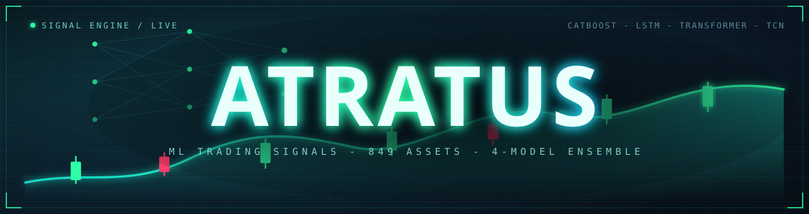
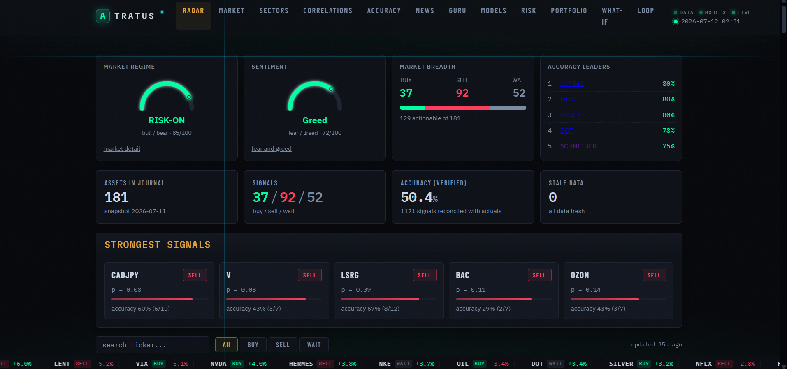
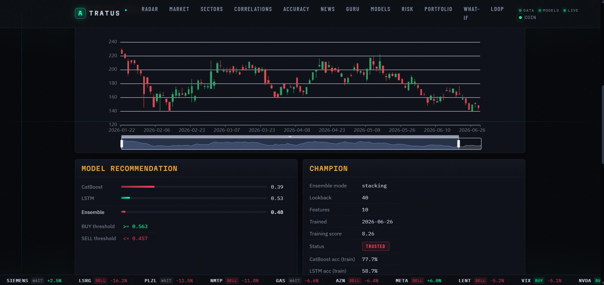

# Atratus



[](https://github.com/pavlenchichikov/Atratus/actions/workflows/ci.yml)
[](https://www.python.org/)
[](https://github.com/astral-sh/ruff)
[](LICENSE)

**English** | [**Русский**](#русский)

<details open>
<summary><b>English</b></summary>

<br>

**Multi-asset machine-learning trading-signal engine.** A per-asset ensemble (CatBoost + LSTM + Transformer + TCN) over 849 markets - crypto, US / European / Russian equities, indices, rates, volatility, bond and sector ETFs, forex and commodities - with walk-forward selection, calibrated probabilities, Kelly sizing, tail-risk controls, a FastAPI dashboard, and an autonomous, statistically-gated research agent. Signals only, human-in-the-loop - no auto-execution.

> **Disclaimer.** Atratus is a research and educational project. Its output is a set of model predictions - **not financial advice and not a recommendation to buy or sell any security**. Markets carry risk and you can lose money. The software is provided "as is", without warranty of any kind. Use it at your own risk; do your own research and consult a licensed professional before making any financial decision. See [Disclaimer](#disclaimer) in full.

[](https://github.com/pavlenchichikov/Atratus/releases/latest/download/Atratus.apk)

## Table of contents

- [Features](#features)
- [How it works](#how-it-works)
- [Web UI](#web-ui)
- [Screenshots](#screenshots)
- [Auto-research agent](#auto-research-agent)
- [Per-asset adoption](#per-asset-adoption)
- [Analyst agent](#analyst-agent)
- [Self-maintaining loop](#self-maintaining-loop)
- [Live-accuracy gate and recalibration](#live-accuracy-gate-and-live-recalibration)
- [Telegram bot](#telegram-bot)
- [Publishing signals to the landing site](#publishing-signals-to-the-landing-site)
- [Mobile app](#mobile-app)
- [Tech stack](#tech-stack)
- [Requirements](#requirements)
- [Environment and GPU](#environment-and-gpu)
- [Quick start](#quick-start)
- [The launcher menu](#the-launcher-menu)
- [Daily use](#daily-use)
- [Training](#training)
- [Network](#network)
- [Configuration](#configuration)
- [Project layout](#project-layout)
- [Tests](#tests)
- [License](#license)
- [Disclaimer](#disclaimer)

## Features

- **~847 assets in the map, 830 with a trained champion, one model each.** Every asset trains its own ensemble of four models (CatBoost, LSTM, Transformer, TCN); the champion is chosen by a walk-forward backtest with commissions, slippage and an embargo against leakage.
- **Honest, calibrated signals.** BUY / SELL / WAIT with a calibrated probability, per-asset tuned thresholds, and a live accuracy track record that reconciles each prediction against the realized next-bar move.
- **Risk-managed by design.** Kelly-based position sizing, drawdown stops, sector-exposure and correlation checks, and a Taleb tail-risk index that shrinks size above a soft cap and blocks new buys above a hard cap.
- **Prices, not just calls.** A daily trade-level sheet turns each signal into numbers you can act on: an ATR entry zone around the last close, an emergency stop that trails the position, and a size derived from the distance to that stop and clipped by the risk limits. The same entry zone and stop appear on each asset's own page, every issued set is journalled and later scored against the bars that followed, and the two ATR multipliers behind them can be fitted over the whole history and are adopted only if a held-out slice agrees. Execution stays manual.
- **Rich feature set.** Returns and volatility-normalized returns, tail risk (kurtosis / skew / VaR), RSI / MACD / SMA / ATR, weekly and cross-asset correlations, cross-asset lead-lag, calendar position, and a macro regime read (10y yield, VIX, dollar).
- **Autonomous research agent.** A quality-diversity (MAP-Elites) search over features, labels and transforms, with a rigorous held-out adoption gate (Wilcoxon signed-rank + Benjamini-Hochberg + cross-run replication) so nothing is adopted on noise. Never touches production automatically.
- **Instant FastAPI dashboard.** Reads ready-made predictions from the database (no TensorFlow at serve time), so it starts immediately - signal radar, per-asset detail, portfolio analytics, an interactive risk manager, and a what-if backtester.
- **A second opinion that cannot see the first.** An analyst agent reads bars, volatility regime, fundamentals and the event calendar and returns a discrete judgment - a direction, a conviction, a risk and its reasoning - never a percentage, so each judgment cell accumulates history and can be recalibrated. It is walled off from the ensemble's probability and signal by two tests. Nothing it says reaches a decision until it beats three baselines over 500 scored judgments.
- **The card finally quotes a payoff.** Each asset page shows what a long and a short in it have historically been worth per bar, in percent with an 80% band, fitted from the verified prediction journal. It is frequently negative, and it is shown negative.
- **Value overlay.** A "Guru Council" (Lynch, Buffett, Graham, Munger) as a long-term fundamentals overlay for real stocks, tracked at a 60-day horizon while the ML signal stays primary.

## How it works

1. `data_engine.py` downloads up to 15 years of daily and weekly quotes from Yahoo Finance and MOEX into `market.db` (SQLite).
2. `train_hybrid.py` builds the features (above), trains the ensemble, and saves the champion together with its scaler and probability calibrator, chosen by walk-forward backtest.
3. `predict.py` prints BUY / SELL / WAIT with confidence for all assets.
4. `backtest.py` checks champions on held-out data: PnL, win rate, Sharpe, directional accuracy, Brier, alpha vs buy & hold.
5. `risk_manager.py` and `portfolio.py` do position sizing, loss limits and correlation checks. Tail risk is gated by the Taleb index: size shrinks above the soft cap, new buys are blocked above the hard cap.

Supporting layers: a **Guru Council** value overlay (`guru_report.py`, shown only for assets with real fundamentals), news sentiment (`news_analyzer.py`), a market regime / fear-greed read, and `db_check.py`, a read-only audit of `market.db` (freshness, OHLC sanity, gaps, coverage).

`app.py` is a Streamlit dashboard; the Telegram bot sends signals every hour.

## Web UI

```bash
uvicorn webapp:app --host 0.0.0.0 --port 8000
```

Lightweight web interface - no TensorFlow needed, reads predictions from the database, starts instantly. Pages:

- `/` - signal radar: BUY / SELL / WAIT per asset with confidence, live accuracy, a Taleb tail-risk column, a live market-breadth panel and regime / fear-greed gauges, and a line saying how much of the asset map the snapshot covers and why the rest is absent (no champion, or no bar dated today)
- `/asset/BTC` - per-asset detail: price and candle charts, signal history, model consensus, Taleb tail risk, the Guru Council value verdict (N/A for non-stocks) with on-demand recalculate, the **expected payoff** for a long and a short in that asset, and the **analyst's own call** with its reasoning
- `/analyst` - the analyst agent: how many judgments it has made and how many are scored, interval coverage, the latest judgments with forecast against outcome, and a button that runs a pass
- `/levels` - the trade-level sheet: entry zone, stop and position size per active signal, with a reason on every row that has none
- `/portfolio` - portfolio analytics over open positions: diversification score, sector-exposure heat, held-asset correlation, per-position warnings
- `/whatif` - what-if simulator: "what if I had invested $X, N days ago, following the signals", with an equity curve and per-asset breakdown
- `/risk` - interactive risk manager: open / close positions, edit and persist risk limits, halt / resume trading, plus a Taleb tail-risk watchlist
- `/loop` - self-maintaining loop: daily cycle status and drift proposals, with one-click approve of a champion-challenger retrain
- `/guru` - value overlay: the council verdict next to the ML signal, with a 60-day accuracy track record and a one-click **Recalculate all** that re-scores every stock in the background
- `/experience` - what the search has learned: the funnel from every genome ever
  tried down to the one adopted, per-lever yield, one genome's full record with its
  A/B verdicts and its nearest neighbours by shared genes, and live accuracy per
  model generation. Read-only and derived: it joins the research journals on each
  request and stores nothing
- `/market`, `/sectors`, `/correlations`, `/performance`, `/news`, `/models` - analytics pages

`/research` and `/experience` are deliberately off the nav bar and reached with Cmd/Ctrl-K, so the top row stays the pages looked at daily.

Same data as JSON under `/api/...`. Pages auto-refresh; a Cmd-K palette jumps to any asset or page; a ticker tape of top movers runs along the bottom. Works from a phone on the same network.

## Screenshots

**Signal radar** - the home dashboard: market regime and sentiment gauges, breadth, accuracy leaders, and the strongest live signals with their track record.



**Per-asset detail** - candlestick chart with the model recommendation (per-model probabilities, tuned BUY / SELL thresholds) and the champion card (ensemble mode, training score, trust status).



**Signals on the price** - historical BUY / SELL calls plotted on the price line, with a selectable time range.


**Console output** - `predict.py` prints BUY / SELL / WAIT for every asset with the calibrated probability, the ensemble mode and the Taleb tail-risk read.

```text
$ python predict.py
  REAL-TIME RADAR  |  2026-07-12 02:31

  BTC      BUY    p=0.62  STACK  taleb=0.3
  ETH      WAIT   p=0.51  STACK
  NVDA     BUY    p=0.66  STACK  taleb=0.4
  SBER     SELL   p=0.38  STACK  taleb=1.2
  EURUSD   WAIT   p=0.49  STACK
  GOLD     BUY    p=0.58  STACK  taleb=0.2
```

## Auto-research agent

The feature set can be extended at train time through a constrained transform DSL in `core/feature_dsl.py` (z-score, ratio, lag, diff, rolling, interaction, cross-asset lead-lag over existing columns - no `eval`). Point `GTRADE_DSL_SPECS` at a JSON file of specs and list their names in `GTRADE_EXTRA_FEATURES`; with both unset, training is unchanged.

`auto_research.py` (a local tool, run via `auto_research.bat`) automates the search - a quality-diversity (MAP-Elites) illumination over feature, label and transform genomes, or a simpler forward selection. A proposer suggests a candidate, a cheap CatBoost-only pre-screen drops the obvious losers, and the cached baseline is compared against the candidate. The default proposer is an evolutionary search with no LLM and no API key; `GTRADE_AR_PROPOSER=llm` uses a model instead (Anthropic by default, OpenAI or any OpenAI-compatible endpoint such as Mistral or a **local Ollama** via `GTRADE_AR_LLM=ollama`).

The genome also carries **relative model-hyperparameter genes** (a depth delta, learning-rate and iteration multipliers, a lookback delta - applied on top of each asset's tuned baseline, never as one absolute number for all assets), **net-hygiene genes** (seed-averaging, per-net calibration, uniqueness weighting) and the **triple-barrier label** (its window doubling as the horizon). The same levers are searchable one-at-a-time via the `hyper`, `nets`, `thresholds`, `regime` and extended `labeling` axes in the launcher menu.

Selection-time TUNING is searchable too: a threshold margin and neutral-band delta applied over each asset's own tuned thresholds, and the regime-filter mode (both / off / SMA-only / Taleb-only). The QD archive niches now also key on WHICH lever group a genome touches, so one lever class cannot monopolize the map, and a cheap mid tier (4 assets at half epochs, `GTRADE_AR_TIER=0` to disable) drops clearly-negative candidates before they earn a full training run.

**Illumination mode (`GTRADE_AR_ILLUM`, default `cb`).** What the QD search
trains while it fills the archive. Under `cb` every neural member is replaced by
a constant 0.5, which makes one search step cost seconds instead of minutes - but
it also means the archive, and therefore every elite the run proposes, is a pure
CatBoost selection. A net-only mutation scores exactly like its parent under that
screen, which is why the `nets` emitter is withheld from the bandit there. Set
`full` and the search trains the tier assets with real nets instead, re-keys both
baseline and candidate onto the active basis, and restores the `nets` emitter, so
the search can finally chase a neural lever. It costs roughly 12x per candidate
and is only meaningful together with `GTRADE_AR_SCORE_BASIS=net_auc`: the nets do
not reproduce bit-for-bit on GPU, so on the raw Score basis a full illumination
ranks noise. The launcher warns if the two are mismatched. One caveat that is
silent rather than loud: archive fitness is stored in the units of whichever
basis produced it, so `_qd_archive.json` must be cleared when the basis changes,
or Score-scale elites (1.5 to 8.9) will never lose their niche to an AUC-scale
challenger (~0.01).

Re-gating stored candidates (`--regate`) is **crash-safe**: every finished candidate checkpoints to `_regate_progress.json` and its trains are cached by genome signature, so an interrupted multi-day run resumes where it stopped (as long as the market data has not refreshed in between) instead of restarting from zero.

**It never touches production.** Candidates train into isolated temp directories, and a winner is flagged only after clearing a separate held-out set under a one-sided **Wilcoxon signed-rank** test (with a practical effect-size floor, a **Benjamini-Hochberg** correction across candidates, an iteration budget, and a **cross-run replication** gate) - designed to reject improvements that are only noise. Adopting a flagged winner stays a manual full retrain.

**What the gate measures, and what production decides on.** These were one
constant until they came apart in the open. The search basis is picked for
signal-to-noise: raw Score cannot measure a neural change on this box, so the
campaign searches on `net_auc`. That is an argument about measurability and says
nothing about the quantity production promotes on. On 2026-08-18 an A/B passed on
a mean `net_auc` gain of +0.036 over 14 held-out assets while the same rows, same
models, carried 3 promotions against 10 demotions on Score - rank correlation
between the two of -0.24. The retrain it authorised then kept the champion on 23
of the first 29 assets. Three things came out of it:

- `GTRADE_AR_DECISION_BASIS` lets a campaign name the basis an ADOPTION is judged
  on separately from the one the search optimises. Unset means "the same one", so
  every existing campaign is unchanged; both are frozen for the campaign's life.
- the A/B now also reports the decision production will actually make: how many
  held-out assets would be **promoted** and how many **demoted** at the same
  `+0.2` margin `train_hybrid` uses, with a sign test. A candidate that would
  take a champion away from more assets than it wins is refused whatever the mean
  says.
- a finding from an axis run is offered to the A/B twice: bare, and **composed
  onto the running reference** (`axis:labeling+ref`). The bare form answers "is
  this better than nothing"; only the composed one answers the adoption question,
  "is what runs better with it".
- the **gate size is asked in the launcher**, `[0d]` inside `[AL]`, and one answer
  moves both gates: the search's own held-out set and the final A/B. It is a
  resolution choice, not a preference. The smallest gain a gate can separate from
  noise is `14 -> +2.80`, `40 -> +1.66`, `80 -> +1.17`; the one genome ever
  adopted measured **+1.63**, under the resolution of the 14 it was measured with.
  The list is grown rather than redrawn, so every asset already in it stays and
  earlier measurements remain comparable.

Permanent cross-run memory: `_ar_tried.json` (no candidate is re-tested), `_ar_eval_cache.json` (base trainings reused until new data arrives) and `_ar_findings.json` (the cumulative findings journal), so the budget buys **new** experiments every run.

**Research wiki (optional, `GTRADE_AR_WIKI=1`).** Distills the append-only findings journal into a compounding, self-maintained knowledge base (Karpathy's "LLM Wiki" pattern): after each run an LLM folds new findings into a few interlinked markdown topic pages under `_ar_wiki/`, tagging claims by confidence and reconciling contradictions, and the proposer reads that distilled wiki instead of only the last few findings. The pages also render read-only on `/research`. Off by default (byte-identical).

**RL search scheduler (optional, `GTRADE_AR_RL=1`).** A learned budget allocator over the QD child sources: a discounted Thompson-sampling bandit (with a two-phase context and a guaranteed exploration floor) learns which of nine emitters - feature / hyperparameter / net-hygiene / tuning mutations, crossover, LLM proposals, surrogate picks, a CMA evolution strategy over the continuous genes, and a novelty emitter that targets empty archive niches - actually produce archive improvements, and spends the experiment budget accordingly. Curiosity-based parent selection favors elites whose children keep succeeding. The statistical adoption gate is untouched: the scheduler decides only what to TRY, never what passes. It self-disables within a run if it underperforms the uniform baseline (estimated live from its own exploration draws), and its arm posteriors are printed at run start/end - no black box. Off by default (byte-identical uniform search); toggle in the `auto_research.bat` menu, state in `rl_scheduler_v1.json`.

### Running it

`auto_research.bat` (or `python auto_research.py`) opens a menu. Every answer has
a working default, so pressing Enter through it is a valid run.

| Prompt | What it decides |
| --- | --- |
| `[0]` Action | `1` searches for new candidates; `2` re-gates candidates already stored, reusing their cached trainings |
| `[1]` Mode | `1` qd, the flagship MAP-Elites over the whole genome. `2` features, `3` labeling and pruning, `4` hyper / nets / thresholds / regime, `5` your own axes list. Axes search one lever at a time and do NOT compose, so a list runs them in sequence rather than together |
| `[1a]` Label | The label the whole run uses - the base and every candidate alike - so this is what decides which questions the run can even ask. `1` next-bar direction, `2` triple-barrier at 20 bars, `3` triple-barrier at a horizon you type. The `weighting` axis is a no-op under `1`: a next-bar label spans a single bar, the uniqueness weights come out all ones, and every candidate equals the base |
| `[2]` Proposer | `1` evolutionary, needs nothing. `2` local Ollama, `3` Anthropic, `4` OpenAI. Each then asks for a model name (`auto` picks the largest installed Ollama model) |
| LLM only: max tokens | Cap on one reply, `0` for none. A reasoning model needs room; too small a cap truncates the proposal into an unusable one |
| LLM only: timeout | Seconds for ONE call, `0` for no limit. A timeout is not retried, so a value that is too small quietly costs the whole LLM arm for the run. The 600s SDK default is short for a large local model |
| LLM only: reflect | `2` makes the model first write one line on why the recent experiments failed, then propose with that in front of it. One extra call per step |
| `[3]` Budget | How many NEW candidates this run. Past candidates are never re-tested |
| `[4]` Objective | How per-asset lifts become one number. `mean` by default; `cvar` and `min` optimize the worst assets instead of the average. Six options, table below |
| `[4b]` Score basis | `1` raw ensemble Score, `2` the neural contribution, `3` the nets' own AUC. See below |
| `[5]` Research wiki | `2` folds this run's findings into the knowledge base under `_ar_wiki/` and lets the proposer read it. Uses the LLM backend, so it costs one call at the end. Off by default |
| `[6]` RL scheduler | `2` lets the bandit allocate the budget across child sources instead of drawing uniformly. Off by default; it never affects what passes the gate |
| Illumination | Not a prompt: `GTRADE_AR_ILLUM` in the launcher's knobs block. `cb` (default) illuminates the QD archive on the CatBoost-only screen, `full` on real nets. See below |

**Choosing the objective.** Every candidate produces one Score delta per
held-out asset. The objective is how those numbers become the single value the
adoption gate tests.

| Objective | What it computes | Pick it when |
| --- | --- | --- |
| `mean` | Average lift across the held-out assets | Default. The book as a whole should improve, and one asset getting worse is acceptable if others gain more |
| `min` | The worst asset's lift | Nothing may regress at all. The strictest and the noisiest: a single unlucky asset decides the verdict |
| `median` | The middle lift | Same intent as `mean`, but you suspect one or two extreme assets are dragging the average around |
| `cvar` | Average of the worst quarter | The floor matters but `min` is too jumpy. Usually the better "do no harm" setting |
| `trimmed_mean` | Average with the single best and worst dropped | You want `mean` without the one lucky and the one unlucky asset (the menu calls this one `trimmed`) |
| `sharpe` | Mean divided by the spread of the lifts | Consistency across assets matters more than the size of the average gain |

`sharpe` is dimensionless, so it clears its own floor
(`GTRADE_AR_ADOPT_SHARPE`, default 0.5) rather than the Score-delta floor the
other five share. Changing the objective changes what "better" means, so runs
are comparable only within one objective; the result cache keys on it for that
reason.

**Can neural_lift be the objective?** It already can, through a different
setting. The objective decides how per-asset numbers are reduced; the *basis*
decides which number is measured in the first place.

```
GTRADE_AR_SCORE_BASIS=neural
```

scores each candidate on the neural contribution (the full ensemble minus a
CatBoost-only run) instead of the raw ensemble Score, and it composes with any
of the six objectives above. The `neural_lift` figure printed next to each
verdict is exactly that quantity, always reduced by `mean` for reporting.

It is menu item `[4b]`, which also offers a third basis, `net_auc`: the neural
members' own probabilities, scored as a fold-averaged AUC. Unlike the two Score
bases it is a rank statistic on raw probabilities, so it does not inherit the
Score's instability (measured: on an identical pair of runs the Score moved 129%
of its own noise floor and `net_auc` 6% of its own), which makes it the basis to
use whenever the nets are the subject.

That distinction stopped being academic in August 2026. Five attempts to lift the
neural members - engineered features, a 25-year pretraining set, the adopted
genome, giving the nets their own feature set, and net hygiene - all measured
flat or negative, and the conclusion drawn was that the labeling was the ceiling.
It was not. `build_sequences` was assembling a window that ended one bar BEFORE
the labelled row, so every sequence model was asked to forecast a move starting
from a bar it had never been shown, while CatBoost trained on exactly that bar.
The nets scored 0.5155 AUC, a coin. With the window fixed they read 0.60 and
several assets now beat CatBoost outright. The five earlier results were not
refuted by this, they were never measured, and each is worth re-running.

The practical lesson is in the controls, not the bug: a control has to be a
quantity the change cannot reach, and "cannot reach" has to be checked in the
code rather than assumed from the name. Two clean runs were discarded here
because the control was a CHAMPION-fold statistic, and the champion fold is
chosen by the ensemble's own score - so the nets moved it without CatBoost
changing at all. The honest control is the fold MEAN (`CB_AUC`), which reads
identically whether the nets are real or stubbed out.

Budget is not wall-clock. Under the default `cb` illumination the search phase is
cheap (a CatBoost-only screen, well under a minute per candidate on a GPU) and
the cost is the final gate, which trains the elites in full on the held-out
assets; a 15-candidate run is hours, not minutes. Under `GTRADE_AR_ILLUM=full`
the arithmetic inverts: the search itself becomes the bill at roughly nine
minutes per candidate, so a 100-candidate run is most of a day. `Ctrl+C` is safe
at any point - finished work is cached, the archive persists, and a re-run
resumes where it stopped.

Before spending a long budget, measure what the run can actually resolve:
`ab_noise.py --unit tier --seeds 1000,2000,3000` retrains one identical config
under different seeds and prints the spread next to the adoption floor. A search
whose candidate deltas are smaller than that spread is ranking noise. Run it in
the GPU environment - on CPU the training repeats bit-for-bit and the spread
reads zero, which is the one answer guaranteed to mislead.

Reading the output: `SCREEN_SKIPPED` is the cheap pre-screen doing its job, not
an error. What matters is the per-axis verdict line at the end, and only a
winner that clears the held-out test, the effect floor, the multiplicity
correction and the replication gate is worth acting on. Nothing is adopted
automatically - adopting stays `python adopt_genome.py` followed by a full
retrain.

**Using a local model.** Settings live in `.env` and the agent reads that file:

```
GTRADE_AR_LLM=ollama
GTRADE_AR_LLM_MODEL=gemma4:12b
GTRADE_AR_LLM_TIMEOUT=3600        # seconds per call; the 600s default is short
                                  # for a large local model on CPU
```

Menu answers override the file, so the model picked at the prompt wins. Every
call is traced to the console (`[llm] genome: asking ollama/... , N char prompt`
then the reply size and elapsed seconds), so a slow or empty local model is
visible rather than silent. A model that does not fit in RAM will be slow enough
to hit the timeout; if it does, the run says so once and finishes on the
evolutionary operators.

### Running the whole cycle unattended

`auto_loop.py` runs search, gate, A/B and adoption in sequence with no prompt,
and stops before the retrain. It is a state machine, not a model pressing the
menu buttons. Of the nine questions the menu asks, one is an open choice (the
axes) and two are budget; the rest are a lookup from the score basis or a
setting that must be frozen before anything is measured. Letting a model pick
the basis, objective or alpha after seeing a verdict would be p-hacking on a
schedule, so those live in `CAMPAIGN` at the top of the file, are frozen on the
first cycle and re-checked on every one. Nothing in that file decides whether a
result counts: that stays with the Benjamini-Hochberg gate in `auto_research`
and with `ab_build.verdict`.

```
python auto_loop.py               # cycle until an adoption, a failure or --stop
python auto_loop.py --dry-run     # the phase it would run now, touching nothing
python auto_loop.py --status      # the stage it is in, plus recent history
python auto_loop.py --hours 12    # add a deadline instead of running open-ended
python auto_loop.py --stop        # ask a running loop to stop cleanly
```

It keeps cycling until something is adopted. A failed A/B is not an ending: the
candidate is recorded as measured against this reference, the next cycle takes
the next gate-adoptable elite, and when none is left it goes back to searching.
Every phase prints a banner with the cycle number, the stage, the reference, the
campaign and the load it is running under, and the same stage is published to
the `/research` page so a run that started overnight can be read from a phone.
When an adoption finally happens the loop stops and prints the full report:
evidence with its p-value and floor in the right units, the genes that leave
their default, the training env a retrain will run under, the previous adoption
for comparison, and the genome itself. It is also written to
`_auto_loop_report.txt`, because a night of scrollback buries it otherwise.

The phase is derived from the files each cycle rather than stored, so a phase
run by hand leaves the loop in the right state. The campaign is also checked for
settings that contradict each other: `GTRADE_AR_SCREEN=1` on a net basis (the
screen stubs every neural member to a constant, so every candidate screens
alike), or `GTRADE_AR_ILLUM=full` on the raw Score basis (net training does not
reproduce on this GPU, so the archive would rank noise). Those rules used to
exist only as prose in the launcher's REM block, where a human reading the menu
applied them.

The phases are the same commands as by hand: `auto_research.py`,
`ab_build.py --auto`, `ab_build.py --run`, `adopt_genome.py --auto`. It stops
after an adoption on purpose: `models/` still holds the previous generation
until `train_chunked.py` runs, so a second adoption would stack two genome
changes onto one un-retrained model set.

**Stopping and resuming.** `python auto_loop.py --stop` asks a running loop to
finish its phase and exit, and `--status` prints where it stands. Killing it is
safe too: it costs only what the running phase had not checkpointed, and every
phase resumes on the next start. The search saves the archive after every genome
and banks the signature before evaluating it, so at most one genome is lost. A
finished A/B arm is cached by genome signature, so a restart re-reads it instead
of retraining. Held-out training caches per chunk under `GTRADE_AR_TRAIN_CHUNK`
(0, the default, is one process for the whole subset exactly as before), so an
interrupted arm loses one chunk rather than all 8 to 11 hours. That is the same
trick `train_chunked.py` uses on the production retrain, for the same reason.

**Load.** Net training on this box is host-bound, not compute-bound: the models
are small enough that the GPU is busy about 5 ms per step and idle 50 ms, so
roughly nine tenths of the wall clock is Python and TensorFlow bookkeeping
between steps. That is why adding concurrency *inside* a process does not help.
A second neural slot was tried on 2026-08-17 and every unit came back empty:
assets carry different sequence lengths, and two of them sharing one TF graph
produced models built for one length being handed another's data. It stays at 1.

The parallelism that does work is by PROCESS. `GTRADE_AR_TRAIN_JOBS` runs that
many training chunks at once, each a separate `train_hybrid` with its own graph,
so that failure cannot happen at all. `split_load` divides what is sized against
the whole box (the TF pool and the CatBoost threads) between them. Measured on
the four tier assets:

```
1 process    624.8 s   peak VRAM 3097 MiB
2 processes  458.8 s   peak VRAM 3956 MiB
```

27% faster, both returning all four rows. Each process is 43% slower than it was
alone; the gain is purely overlap, which is what a host-bound workload looks
like. `GTRADE_AR_TRAIN_CHUNK` is a CAP on assets per chunk, not a target: the
effective size is the smaller of it and `ceil(assets / jobs)`, because at 7 it
never split the 4-asset search unit at all and the parallel path was dead
exactly where the loop spends its time. The cost is headroom: 3956 of 4096 MiB leaves 140 MiB, so if a unit ever
dies out of memory the retry drops to one process and the fix is to lower
`GTRADE_TF_POOL_PCT`, not to raise the job count. `GTRADE_WORKERS` is
deliberately left derived: a holdout arm already holds about 6 GB with 4.1 free,
so raising it trades a stall for a swap.

**Campaign director (optional, `GTRADE_AR_DIRECTOR=1`).** An LLM that reads the
findings journal and picks the next experiment: axis, label, budget, whether to
spend the LLM proposer arm. Its reply is checked against a whitelist. An unknown
axis, a budget out of range, or any key outside the list is refused rather than
clamped, and a partly understood reply is never half applied, because a run
nobody chose is worse than a repeated one. It cannot set the score basis or the
objective at all: its only route to those is a `new_campaign` request carrying a
written reason. An unreachable or unparseable model falls back to the campaign
already in force, so the loop never stops for it.

**Choosing the basis and the objective.** They are frozen when a campaign starts,
because choosing them after seeing a verdict is a search for a verdict that
passes rather than a measurement. So they are picked at the start and nowhere
else: answer 2 to `[0]` in the launcher, or pass `--new-campaign`. Either way the
loop re-freezes them and sets the search archive aside, because Score-scale
fitness (1.5 to 8.9) would outrank AUC-scale fitness (about 0.01) for the rest of
the run. The screen and the illumination are then derived from the basis rather
than asked, since only one pairing of them is coherent with each. Moving a frozen
constant without starting a new campaign refuses the run, and the refusal names
this way out.

## Per-asset adoption

A genome's effect is not the same on every asset. Measured 2026-09-02: the
candidate that FAILED its gate at -0.30 over 40 assets was worth **+1.20 on RTX**
and **-3.84 on ROSN**, both confirmed afterwards on seeds the selection had never
seen. Adopting it everywhere or nowhere throws away both facts, so an asset can
keep the genome that was measured on IT while everything else stays on the global
adoption.

### The three steps

The order is not decoration. Each step answers a question the next one needs.

1. **Look for per-asset differences** (`ab_per_asset.py`, free, trains nothing).
   It recovers every per-seed arm of the last A/B out of `_ar_eval_cache.json`
   and prints, per asset, the delta with its OWN standard error, plus how much of
   the spread is real difference rather than seed noise. Read it by the ratio,
   not by the size: on the first run the asset with the largest `se` was the one
   that later flipped sign.

   The arms are identified by time against `gtrade.log`, which is an inference,
   so the tool checks it: the mean of the recovered deltas has to reproduce the
   `value_raw` the run recorded, and it refuses to report anything if it does not.

2. **Confirm the picks on fresh seeds** (`ab_confirm.py`, hours, trains). The
   assets step 1 picks are the extremes of a noisy set, and extremes are
   overstated by being picked: the three selected on 2026-09-02 kept **30%** of
   their measured effect when re-measured. This step re-measures exactly what
   step 1 picked, under seeds outside the A/B's own roll - it refuses a seed the
   A/B used, because the cache would answer it and the run would confirm its own
   numbers.

3. **Adopt what survived** (`adopt_genome.py --asset ASSET --evidence TEXT`).
   Refuses without evidence, without a genome, and without a global adoption to
   sit beside. The evidence must be the REPLICATION, never the pass that selected
   the asset.

Yield, over three runs: roughly one of every three picked extremes survives its
replication. RTX and AUDCAD are the two that did.

### What it costs the rest of the system

Almost nothing, because a genome is already a process-wide environment and the
trainer already starts one process per chunk:

- `core/adopted.py` gains `per_asset` in `adopted_genome.json`, `genome_for(asset)`
  for one asset and `genome_for_assets(csv)` for one PROCESS. `specs()` now
  returns the UNION of DSL specs over every genome in force, because `core.scoring`
  refuses an asset whose saved feature list names a column the frame does not have.
- `config.py` resolves the genome from `GTRADE_ASSETS` instead of always taking
  the global one, and exports the keys it set. Serving names no assets and so
  still gets the global genome, exactly as before.
- `train_chunked.py` groups the assets by genome before chunking, so a chunk never
  mixes two, and strips the parent's resolved keys from the child environment -
  otherwise every chunk would inherit whichever genome the parent resolved first.
- `train_hybrid.py` does not change at all.

`[AS]` lists every exception with its genes and its evidence. An exception nobody
can see is the worst kind.

## Analyst agent

A second opinion on each asset, formed **without ever seeing the ensemble's own
call**. It never sees the model probability, the emitted signal, the timing
action or the sizing decision; two tests enforce that, one scanning the
serialized dossier for forbidden keys and one pinning the dossier's exact key
set so a new field cannot be added without somebody declaring it.

It reads what the project already computes: bars and ATR, the volatility
regime, the Guru Council's fundamental verdict, the earnings and macro
calendars. The council verdict is fundamentals, not the ensemble, so it is
allowed in on purpose.

**It returns a discrete judgment, never a percentage** - a direction, a
conviction 1 to 5, an expected volatility regime, the one risk most likely to
make it wrong, and its reasoning. That is the whole design: a free-form number
from a model is measurable but uncorrectable, because every answer is unique
and no bucket ever accumulates the history needed to recalibrate it. A discrete
cell does accumulate, and earns its own measured payoff.

The percentage on the card is therefore **not the analyst's number**. It is
what that judgment cell has historically been worth, so it can and does
contradict the call above it: on an asset class whose longs lost money, a
bullish call carries a negative figure, and the card says so rather than hiding
it. Until a cell has scored outcomes of its own the figure is the class
baseline, which means the conviction shown beside it moves nothing - a 1/5 and
a 5/5 call in the same direction currently produce the same number. The card
states that outright too.

That baseline comes from `train_payoff.py`, which fits what a position has
historically been worth per asset and per asset class in ATR units, from the
verified rows in `prediction_log`. One artifact, two jobs: the prior every
calibration cell starts from, and the baseline the analyst has to beat. Note
what it is measured over - only the bars the ensemble chose to signal on - so
it is that conditional payoff, not an unconditional historical average.

Judgments are written to `analyst_log` before their outcome exists, and the
backfill that scores them runs inside `loop_cycle.py` as a step of the daily
cycle rather than as a script somebody has to remember. That is deliberate:
`guru_log` holds hundreds of verdicts and almost no scored outcomes for exactly
that reason.

**Nothing it says is trusted yet.** `analyst.py score` measures it against
three baselines - forecasting nothing, the empirical payoff for the direction
it chose, and the payoff for the direction the ensemble chose - and prints SHIP
or HOLD. SHIP needs at least 500 scored judgments, interval coverage between
0.75 and 0.85, a shuffle control that collapses when forecasts are detached
from their outcomes, and a lower error than both the zero and the empirical
baseline. A HOLD is a result, not a failure, and the criteria were fixed before
any number arrived.

### Running it

```bash
python analyst.py run                        # watchlist, plus anything reporting earnings today
python analyst.py run --assets SBER,AAPL     # exactly these, now
python analyst.py run --llm ollama --model qwen2.5:32b   # this run only, .env untouched
python analyst.py score                      # standings against the baselines, and the verdict
python analyst.py backfill                   # fill outcomes whose horizon has elapsed
```

`run_gtrade.bat` has the same under `[AN]`, which asks for the asset list and
the provider and requires a typed YES for anything that spends money. The web
page has a **Run now** button that refuses a second pass while one is running,
because a double click would pay for every eligible asset twice.

Cost is bounded three ways: it runs the watchlist plus earnings-today assets
rather than the whole map, it skips any asset whose dossier is unchanged since
it was last judged, and `GTRADE_ANALYST=0` switches it off entirely - in the
web exactly as on the command line.

## Self-maintaining loop

`loop_cycle.py` runs the safe daily pipeline (data, predict, reconcile) and scans every asset for drift - rolling accuracy below a floor, a drop from the trained baseline, model age, or stale data. Proposals surface on `/loop`. Approving one runs `loop_retrain.py`, a RAM-safe champion-challenger retrain that replaces a champion only if the fresh model beats it. **The loop never retrains on its own; retraining always waits for your approval.** Register `run_loop.bat` with Task Scheduler to run daily. Drift thresholds live in `core/drift.py` (`DRIFT_CONFIG`).

## Live-accuracy gate and live recalibration

Signals whose SEGMENT is provably bad in the live track record are suppressed
to WAIT before display (`core/live_gate.py`): an asset class below 45%
verified accuracy (n >= 100), an asset below 40% (n >= 20), or an
anti-calibrated extreme probability (>= 0.85 / <= 0.15). The tracker keeps
logging the RAW signal, so a gated segment rehabilitates itself when fresh
statistics improve; the radar and the web UI show a "gated" badge with the
reason. `GTRADE_LIVE_GATE=0` disables the gate; the thresholds live in
`GTRADE_LIVE_GATE_*` env knobs.

`python recalibrate_live.py` (weekly) fits a global isotonic layer mapping
raw serve probabilities to the live P(up) from verified outcomes
(`models/live_calib_global.pkl`; delete the file to roll back).

The accuracy shown per asset is scoped to the current model generation, but
falls back to the lifetime record across all generations when the active model
has too few verified signals yet - so a retrain never blanks the panel for an
asset with real history.

## Telegram bot

`python alert_bot.py` runs the hourly scan over the full asset universe, scoring each asset through the same shared pipeline as `predict.py` (`core/scoring.py`), so its Telegram calls match the dashboard. It also serves `/top`, `/signal BTC`, `/risk`, `/digest` (owner only), a morning digest (`GTRADE_DIGEST_HOUR`, default 9), and degradation warnings (data older than 7 days, or accuracy below 40% on the last 20 verified signals).

## Publishing signals to the landing site

`push_signals.py` exports the latest signal snapshot to a Supabase project that
backs the public landing site. It reads the per-asset latest signal and accuracy
from the local journal (no models are loaded), then upserts a full `signals`
table (gated behind a per-user allow-list by row-level security) and an
anonymized `public_stats` row (the public teaser: BUY / SELL / WAIT counts,
accuracy, breadth, and the snapshot date).

The same run also feeds the mobile app: it exports per-asset OHLC history
(`bars`), the recent signal track record (`signal_history`) and Guru Council
verdicts (`guru`, `guru_stats`) - all gated by the same allow-list - and, when
`GTRADE_FCM_CREDS` points to a Firebase service-account JSON, sends a personal
push notification reporting what changed since the previous snapshot (a flip,
a new entry, an exit) to registered devices of allow-listed users. It stays
silent when nothing changed, and tapping it opens the app straight to the
Today screen.

Set `SUPABASE_URL` and `SUPABASE_SERVICE_KEY` in `.env` (the service key is
secret and must never be committed or shipped to the browser), then run it after
`predict.py`:

```bash
python push_signals.py          # or option [SG] in run_gtrade.bat
```

Run it by hand daily, or schedule it (Task Scheduler) once you are happy with it.

## Mobile app

A companion **Flutter** app (Android) is a thin client of the same Supabase
snapshot: no models and no market data ship in the app, it only reads the gated
feed `push_signals.py` publishes. Magic-link sign-in plus the same per-user
allow-list (row-level security) gate every screen. It offers a signal radar,
per-asset detail with charts, the Guru value overlay, a market-sector
breakdown, an accuracy leaderboard, a recent-verified-calls feed, a
client-side what-if simulator and the trade-level sheet, refreshing on
resume and pull-to-refresh. The levels screen is the one to trade from when
the orders themselves are placed by hand in a bank app.
Optional Firebase Cloud Messaging (`GTRADE_FCM_CREDS`) delivers a push
notification when signals change, opening the Today screen. The Supabase schema for these tables lives in
[`supabase/mobile_app.sql`](supabase/mobile_app.sql).

## Tech stack

- **Language:** Python 3.12
- **ML:** CatBoost, TensorFlow / Keras (LSTM, Transformer, TCN), scikit-learn, Optuna, scipy
- **Serving / UI:** FastAPI + Uvicorn (web UI), Streamlit (`app.py`), Jinja2
- **Mobile:** Flutter (Android) thin client over Supabase; Firebase Cloud Messaging
- **Data:** SQLite (`market.db`), pandas / numpy, Yahoo Finance + MOEX
- **Research agent:** MAP-Elites quality-diversity search; pluggable LLM proposer (Anthropic / OpenAI / local Ollama)
- **Ops / tooling:** Ruff, pytest, GitHub Actions CI, Telegram Bot API

## Requirements

- **Python 3.12** (3.11+ likely works; 3.12 is what CI runs).
- **OS:** Linux, macOS or Windows. On Windows a GPU needs the pinned environment described in [Environment and GPU](#environment-and-gpu): TensorFlow ships CPU-only Windows wheels from 2.11 on, so a default install never sees the card.
- **Disk:** ~8 GB free - trained models (~5.7 GB for 830 assets) plus `market.db` (~310 MB). Serving alone needs far less.
- **RAM:** 8 GB is enough to run the dashboard and `predict.py` (no TensorFlow at serve time). Training the full universe wants ~16 GB, or train in chunks of ~15 assets (`GTRADE_ASSETS`) on a smaller box.
- **GPU:** optional but worth having. On one RTX 2050 a single asset trains in 158 s against 2850 to 10480 s for the same asset on a 12-thread CPU. Everything still runs without a GPU, just slower. CatBoost can also use a GPU (`GTRADE_CB_DEVICE=GPU`) but is often slower on the small per-asset datasets.
- **Network:** outbound access to Yahoo Finance and MOEX for data (`SOCKS5_PROXY` supported).

## Environment and GPU

On Windows the project runs inside a dedicated conda environment. This is not a preference: **TensorFlow dropped native-Windows CUDA support after 2.10**, so every wheel from 2.11 on is CPU-only no matter which card is installed, and 2.10 has no build for Python 3.11+. The pinned combination is therefore Python 3.10 with TensorFlow 2.10.

### Getting it

Nothing to prepare. Any launcher creates the environment on first use and activates it afterwards:

```bat
auto_research.bat        :: research agent
run_gtrade.bat           :: main menu
call activate_env.bat    :: just the environment, for a manual session
```

The first run downloads CUDA, cuDNN and TensorFlow, which takes a while. Later runs only activate.

Three files, one responsibility each:

| File | Purpose |
| --- | --- |
| `env_config.bat` | the only place that names the environment and pins versions |
| `activate_env.bat` | finds conda, creates the environment if missing, activates, verifies |
| `setup_gpu.bat` | the installer; detects the card and picks matching CUDA/cuDNN |

### Different machines, different cards

`setup_gpu.bat` reads `nvidia-smi` and installs accordingly, so the same repository works on a laptop with an RTX 2050 and on a desktop with a 3090 without editing anything.

| Card | Result |
| --- | --- |
| GTX 16xx, RTX 20xx / 30xx / 40xx, Tesla and Quadro of those generations | GPU, CUDA 11.8 |
| Older NVIDIA, or a driver too old for 11.8 | GPU, automatic fallback to CUDA 11.2 |
| Anything newer than Ada (compute capability 9.0 and above) | CPU: CUDA 11.x does not support those cards, and TF 2.10 cannot use anything newer |
| AMD, Intel, no discrete card | CPU, `tensorflow-cpu` is installed instead |

VRAM matters more than model size here. The trainer keeps one neural slot per GPU precisely because concurrent cuDNN contexts fit poorly: on a 4 GB card TensorFlow gets about 1.6 GB after the desktop takes its share.

### Confirming it actually worked

Two lines in the first minute:

```
[env] jackpot_gpu active  (C:\Users\...\envs\jackpot_gpu)
[GPU] /physical_device:GPU:0  |  VRAM: 4096MB  |  TF pool: 2457MB
```

If the second line reads `[CPU] No GPU detected`, stop the run. A wrong environment does not fail loudly on its own: it just trains many times slower.

### Models are not portable between Keras versions

This is the sharp edge. Keras 3 writes `.keras` as a zip archive, Keras 2 writes HDF5 under the same file name, and **neither reads the other**. A champion saved by one environment loads as `None` in the other, and the legacy rebuild path then serves a half-initialised network at about 0.5 without an obvious error.

Consequences:

- Switching an existing installation to this environment requires retraining every asset. There is no converter.
- Back up `models/` before that retrain. Roughly 5.7 GB for 830 assets.
- Do not mix: train in one environment and serve in the other, and the neural members silently disappear from the ensemble.
- A champion that exists on disk but does not load now logs a `WARNING` naming the file and the reason. Grep the log for `Champion exists but did not load` after any environment change.

### Linux and macOS

No `.bat` files are involved. A normal virtualenv with the pinned requirements is enough, and TensorFlow finds a CUDA GPU natively without version gymnastics. The Windows constraints above exist only because of the dropped Windows CUDA builds.

### Troubleshooting

- **`conda activate` prints "The system cannot find the path specified"** and the run continues on the wrong python: conda has not been initialised for `cmd.exe`. `activate_env.bat` calls the conda hook itself, so use the launchers rather than typing `conda activate` in a bare console. Note that this failure does not set `errorlevel`, which is why the script verifies `CONDA_PREFIX` instead.
- **`Could not load dynamic library 'cudnn64_8.dll'`**: the environment's `Library\bin` is missing from `PATH`. It happens when the environment's `python.exe` is called by full path instead of being activated. Activate, do not point at the interpreter.
- **`conda env list` shows a different name**: edit `GTRADE_ENV` in `env_config.bat`. Both the installer and the launcher follow it.
- **The research agent looks slower than expected on a fresh machine**: the ETA is computed from a stored timing history that may have been measured on other hardware. It corrects itself after a few units.

## Quick start

```bash
pip install -r requirements.txt
cp .env.example .env          # telegram token, proxy if needed

python data_engine.py         # download market data
python train_hybrid.py        # train models
python predict.py             # console signals
streamlit run app.py          # dashboard
```

`run_gtrade.bat` opens a text menu over all of the above (full cycle, dashboard, web UI, predict, DB audit, and more). `python db_check.py` runs a read-only audit of `market.db` (`--fix` repairs duplicates and date formats). `python scheduler.py` runs as a daemon: data every 6h, predictions every 4h, a daily DB check.

## The launcher menu

`run_gtrade.bat` is the front door. It never activates the GPU environment in the window you are sitting in: every entry that trains something runs through `run_in_env.bat` in a child process, so the menu itself stays on base python and a later serve cannot silently lose its neural champions.

Keys are case-insensitive. Enter on its own at a sub-prompt takes the default shown in brackets.

### DAILY

| Key | Runs | Notes |
| --- | --- | --- |
| `1` | `data_engine.py`, then `train_hybrid.py`, then `predict.py` | The whole cycle. Hours. |
| `2` | `streamlit run app.py` | The Streamlit dashboard. |
| `3` | `predict.py` | Scores every asset and writes `prediction_log`. |
| `4` | `data_engine.py` | Today's bars only. |
| `WU` | `uvicorn webapp:app --port 8000` | The FastAPI web UI, opened on the dashboard. |

### TRAINING

| Key | Runs | Notes |
| --- | --- | --- |
| `5` | `train_hybrid.py` | Every asset in one process. |
| `5C` | `train_chunked.py` | One fresh process per chunk, resumable, champion-challenger. |
| `5R` | `train_hybrid.py` on a named list | Asks which assets, and whether to force-promote. |
| `5F` | `model_health.py --list`, then `train_chunked.py` | Asks: fill in assets with no champion, repair degraded ones, or both. |
| `T` | `optuna_tune.py` | Per-asset hyperparameter search. |

### SIGNALS

| Key | Runs | Notes |
| --- | --- | --- |
| `6` | `backtest.py` | |
| `M` | `model_health.py` | Champion inventory and generations. |
| `E` | `export_signals.py` | CSV. |
| `L` | `signal_log.py` | |
| `H` | `performance_report.py` | HTML. |
| `Q` | `equity_curve.py` | |
| `SG` | `push_signals.py` | Publishes the latest snapshot to Supabase for the landing site. |

### ANALYTICS

| Key | Runs | Notes |
| --- | --- | --- |
| `N` | `news_analyzer.py` | |
| `D` | `news_analyzer.py --digest` | |
| `R` | `regime_detector.py` | Trend, volatility and momentum per asset, plus market breadth. |
| `C` | `correlation_alert.py` | Cross-asset correlation and the stress reading. |
| `WL` | `watchlist.py` | |
| `P` | `paper_trading.py` | |
| `W1` to `W4` | `whatif_simulator.py` with fixed presets | Top-5 or top-10, 90 or 180 days, equal or Kelly weights. |
| `W5` | `whatif_simulator.py` | Asks for assets, days and capital. |

### RESEARCH

| Key | Runs | Notes |
| --- | --- | --- |
| `RS` | `auto_research.bat` | Its own menu. See below. |
| `AN` | `analyst.py` | Its own menu. See below. |
| `AL` | `auto_loop.py` | The unattended search, A/B and adopt cycle. Its own questions. See below. |
| `ALS` | `auto_loop.py --status` | Asks whether to also stop the loop. |
| `LC` | `loop_cycle.py` | One daily maintenance pass. |

### POLICIES

| Key | Runs | Notes |
| --- | --- | --- |
| `TP` | `train_timing.py` | Fits the Stage-A timing rules. |
| `TB` | `train_timing.py --stage b` | The fitted-Q challenger. Asks the number of Q iterations. |
| `TO` | `train_timing_online.py` | One online tick. Asks the self-collection share. |
| `TL` | `train_levels.py` | Entry zone and stop. Asks the search budget. |
| `SZ` | `train_sizing.py` | Position sizing at matched exposure. Asks the budget. |
| `DR` | `train_direction.py` | Follow, stand aside or invert, fitted on LIVE outcomes. Asks how many days. |
| `RC` | `recalibrate_live.py` | Recalibrates live probabilities. |
| `OS` | `train_timing.py`, `train_sizing.py` or `train_levels.py` | Refits one policy on assets it was never scored on. Asks which, which assets, and the budget. |
| `PS` | `policy_status.py` | How the fitted policies did on LIVE signals. Asks how many days. |
| `TR` | `train_timing.py --replay` | How often each layer's decision was right. Asks which assets. |

### GENOME

| Key | Runs | Notes |
| --- | --- | --- |
| `AG` | `adopt_genome.py` | Adopt a genome. |
| `AS` | `adopt_genome.py --show` | What is adopted right now. |
| `AR` | `adopt_genome.py --revert` | Revert the adoption. |
| `PA` | submenu | Per-asset adoption, step by step. See below. |
| `ABC` | `ab_build.py` | Configures an A/B. |
| `ABR` | `ab_build.py --run` | Runs the configured one. |

### SERVICES

| Key | Runs | Notes |
| --- | --- | --- |
| `7` | `alert_bot.py` | Telegram bot, runs until stopped. |
| `8` | `scheduler.py` | Daemon: data every 6h, predictions every 4h, a daily DB check. |
| `9` | `db_check.py` | Read-only audit of `market.db`. |
| `F` | `db_check.py --fix` | Repairs duplicates and date formats. |
| `B` | `db_backup.py` | |
| `I` | `pip install ...` | Install or repair the dependency set. |
| `0` | | Exit. |

### The submenus

**`[RS]` auto-research.** Hands over to `auto_research.bat`, which asks, in order: the action (search for new candidates, or re-gate stored ones); the mode (`qd`, features, labeling, model levers, or a custom axes list); the label for the run; the proposer (evolutionary, or an LLM through Ollama, Anthropic or OpenAI); the budget in new genomes; the objective; the score basis; the wiki; and the RL scheduler.

The answer that matters most is the score basis. On a net basis (`net_auc`, `net_gain`, `ens_auc`) the screen switches off and the illumination trains real nets, so the basis decides which genomes become elites. On `raw` or `neural` the search illuminates on the CatBoost-only screen and the basis only re-scores the final gate. Load settings are not asked: they are derived from the campaign, and they are not part of the eval-cache key, so changing them between runs would compare a cached base against differently trained candidates.

**`[AL]` autonomous cycle.** Runs search, A/B and adopt until something is adopted or you stop it, and stops before the retrain. It asks whether to continue the current campaign or start a new one; a new one then asks the score basis, the illumination, the objective, the decision basis and the gate size. Those are frozen for the campaign on purpose: choosing them after seeing a verdict is a search for a verdict that passes rather than a measurement. Then the director, the proposer, the wiki, the iterations per cycle, and a deadline in hours.

**`[PA]` per-asset adoption.** Six entries in the order they have to be run, each
saying what it costs: 1 looks for per-asset differences (free, trains nothing);
2 confirms what 1 picked, on fresh seeds, after showing the plan and asking
whether to start; 3 adopts one asset and asks for the replication evidence;
4 retrains only the assets whose genome moved; 5 shows the adoption with its
exceptions; 6 puts an asset back on the global genome. Steps 1 and 2 ship with
the project rather than living beside it - a menu entry pointing at a file that
is not in the repository is not an offer. See [Per-asset adoption](#per-asset-adoption).

**`[AN]` analyst agent.** Score, backfill outcomes, refit the payoff table, run one judgment per eligible asset, or open the web UI on the analyst page. The run option asks for assets, the LLM provider and model, and a typed `YES`, because it spends one model call per asset.

**`[5F]` fill in / repair champions.** Asks whether to fill in assets that never had a champion, repair the ones whose neural champion does not load here, or both. Force-promote is on for the repair half, which needs it.

**`[TO]` one online tick.** Asks the self-collection share: how much of the transition buffer is generated by the current accepted Q instead of by the rules. Whatever you pick, agreement is still measured against the rules, so only the data moves and never the trust region.

**`[OS]` refit on unscored assets.** Asks which policy, which assets, and the search budget.

## Daily use

Two commands, in this order, every trading day:

```bash
python data_engine.py     # pull today's bars
python predict.py         # score every asset, write prediction_log
```

Order matters. `predict.py` writes a `prediction_log` row only for an asset that
has a bar dated today, and skips the rest rather than creating a row it could
never reconcile against a real move.

**The universe does not arrive all at once.** It spans four session families:

| family | assets | when today's bar exists |
|---|---|---|
| MOEX (Russian equities) | 50 | after the Moscow close, earliest of the three venues |
| European equities and indices | 36 | after the European close |
| US equities | 60 | last, only once the US session has produced a bar |
| forex, crypto, commodities, benchmarks | 62 | forex 24/5, crypto 24/7, the rest follow their venue |

So a morning run is expected to be short, and an evening Moscow-time run still
leaves the ~60 US names out. **A radar showing fewer than 849 assets is that, not
a bug.** Nothing is lost either way: a second run later the same day fills in the
assets that were missing, because a row already written for an asset today is
skipped rather than duplicated.

For one complete picture per day, run `data_engine.py` then `predict.py` after
the US close. If you want the Russian and European names acted on earlier, run
the pair twice - once in the Moscow evening, once after the US close.

Then open the dashboard and read it in this order:

```bash
uvicorn webapp:app --port 8000     # http://127.0.0.1:8000
```

| Page | The question it answers |
| --- | --- |
| `/` Radar | What is the model saying today, across every asset, with live accuracy per row |
| `/levels` | **At what price do I act** - entry zone, stop and size per setup |
| `/asset/NAME` | Why this asset: probability history, positions, Guru verdict, news, events |
| `/risk` | How much am I allowed to risk, and is trading halted |
| `/portfolio` | What is open now, and how correlated is it |
| `/performance` | Is the model actually right lately (verified outcomes only), including calibration by stated confidence, accuracy per asset, and a comparison of model generations |
| `/loop` | Which models have drifted and want a retrain |
| `/research` | What the research agent has learned so far |
| `/experience` | Which levers ever paid, and why a given genome was not adopted |

Signals alone do not tell you where to enter or where to get out. `/levels`
does, and it is the page to trade from.

Both numbers below are multiples of **ATR** (average true range over the last 14
bars): the typical distance this asset travels in a day, counting overnight gaps
rather than only the high-to-low range. Using it as the unit is what lets one
rule fit every market - the same `2 ATR` stop is wide on Bitcoin and tight on
EURUSD, with no per-asset tuning and no round numbers that a volatile asset would
blow through on an ordinary day.

- **Entry zone** - `close +- 0.5 ATR` around yesterday's close. Inside the zone,
  take the setup; outside it, skip that row. Atratus sees daily bars only, so it
  cannot check this for you - the zone is a morning plan, verified at the broker.
- **Stop** - `2 ATR` against the position, trailing to the best bar once a
  position is more than a day old. It is insurance against a gap, not the normal
  exit: the normal exit is the signal turning WAIT or SELL.
- **Size** - risk per trade divided by the distance to the stop, then clipped by
  the `/risk` limits. The row names whichever limit bound it.
- **`past its stop`** - the price has already gone through the trailing stop, so
  the position should already be closed. These rows are not new setups.

**Where those two multipliers come from, and whether they work.** They shipped as
constants (`0.5 ATR` for the zone, `2 ATR` for the stop) that nobody had ever
fitted or measured. Three things changed that:

- the same entry zone and stop now appear on each asset's own page, beside the
  signal, with a line saying whether the numbers come from the shipped constants
  or from a fitted policy and what evidence that policy was accepted on;
- every set of levels the radar issues is written to a `level_log` journal, and a
  later pass walks each one forward over real bars: was the zone touched, did the
  stop get hit or did the signal turn first, and what did the trade make net of
  both legs. Until this existed, "did the levels make money" could not be
  answered for a single day. One row per position OPENED, not one per day held:
  re-issuing on every held bar wrote rows that could never resolve into a trade,
  and 117 of the journal's first 248 closed as "not a setup: position already
  open". The fit scores one trade per entered segment, so the journal records
  one too;
- `[TL]` in the launcher fits the multipliers over the history of every asset at
  once, with the timing policy held fixed, and writes `levels_policy.json` ONLY
  if a held-out slice agrees. Every run writes `_levels_report.txt` either way,
  including the per-asset breakdown of who carried the result and who argued
  against it.

### The timing layer, and watching a challenger

The signal says which side; the timing layer says whether to act on it, hold
through it, or sit it out. It is off unless `GTRADE_TIMING_POLICY=1`.

Which policy runs is a second, separate question, `GTRADE_TIMING_STAGE`:

| value | what serves | what is recorded |
| --- | --- | --- |
| unset / `a` | the fitted rules (Stage A) | nothing else |
| `b` | the fitted Q (Stage B, `timing_fqi.cbm`) | nothing else |
| `shadow` | the rules | the Q, beside them, on the same bars |

The two are exclusive, and the split matters: before it existed, `b` was the only
way to get the Q into the live log, and setting it also handed the Q the card's
badge, the journal's timing column and the side the levels are drawn and fitted
on. A policy meant to be watched was deciding everything a person reads.

Under `shadow` the challenger's decision goes to its own `shadow_action` column
and each policy's position is rebuilt from its own history, because a challenger
enters and exits on different bars. It is then checked against what the bar did,
on the same terms a signal's row is: **in a position, the bar went its way; flat
while the signal wanted in, the trade it skipped would not have paid**. The asset
page shows a `Watched Q` stat and a per-row correct/missed column, and
`policy_status.py` scores a `timing B (watched)` arm. The badge is dashed, dim
and worded "would", and it appears only where the challenger DISAGREES with what
actually served.

Stage B is fitted by `[TB]` in the launcher, or
`python train_timing.py --stage b --iters N`. Nothing needs to be run to serve
it: the Q is evaluated inside every radar pass.

### Fitting the levels policy

Six numbers, all multiples of one ATR: a base `k_entry` and `k_stop`, plus four
regime deltas added on top of them (`d_entry_hi_taleb`, `d_entry_risky`,
`d_stop_hi_taleb`, `d_stop_risky`). The deltas default to zero, so a policy that
carries only the base pair behaves exactly like one that never heard of regimes,
which is what makes the flat form the honest baseline for the conditioned one.

The fitter is the project's own **separable evolution strategy** from
`core/ar_rl.py` - the same search machinery the research agent's scheduler uses -
pooled over every asset that has a CatBoost champion, on its full history. The
history is cut 60/20/20 in time: the ES is scored on train, the returned
parameters are the best vector seen on **validation** (not the ES's own training
peak), and the verdict comes from a one-sided **Wilcoxon signed-rank** test on
**test** against the policy that is currently live, not against the shipped
constants - a conditioned fit judged against the constants would take credit for
whatever the flat fit already earned.

There are two environments, `--objective`:

- **`equity`** (default). One set of levels per position, issued on the bar the
  timing policy ENTERS, each trade sized the way production sizes it, off the
  distance to its own stop. The trades do not overlap, so an account could have
  ridden them. The score is **Sharpe and nothing else**: profit and drawdown both
  grow with position size on their own, so a score carrying them picks leverage
  rather than a stop. Measured on 300 synthetic trades at one fixed edge, the
  composite score reads +8.28 at size 0.05 and +13.19 at 0.20; Sharpe reads
  +0.689 at both.
- **`rate`**. A set of levels on every bar carrying a side, exactly as the radar
  issues them daily, scored as net return per bar. Every measurement stored
  before 2026-08-23 is this one. Its ceiling is that those trades overlap, so it
  is a rate and not an equity curve.

Neither reward is the **average of a trade**, which is gameable: a stop tight
enough to scratch every trade raises the mean of a trade while lowering what the
strategy makes.

**What the fit can and cannot answer.** `k_entry` is identifiable and the live
0.94 already sits at the top of its plateau. `k_stop` is **not**: gated against
the live policy over 143 assets, the Sharpe delta rises and then saturates, +0.138
at 8 ATR and +0.163 at both 20 and 40. A 40-ATR stop can never be hit, so the
plateau is the no-stop limit and the data prefers it. Corroborated live: the stop
binds 5.5% of trades at the live 2.05, and 0 of the first 10 resolved journal
trades exited on it - the timing layer's exit already does the work. Keep a stop
for gap and ruin protection, set it from a risk rule, and do not fit it.

The adopted **timing policy is held fixed** while these are fitted. It passed its
own gate already, and moving both at once would leave no way to say which half
earned the result.

```bash
python train_levels.py                        # every asset, budget 300
python train_levels.py --assets SP500,NVDA    # a subset
python train_levels.py --budget 400           # more ES evaluations
python train_levels.py --seed 7               # a different search seed
```

`[TL]` in the launcher is the same thing with a prompt for the budget. Roughly 40
minutes over 830 assets; it fits six numbers, so no GPU is involved and it can
run beside anything else. Nothing is written unless the gate says ADOPT, and
`_levels_report.txt` is written either way.

Sizes appear in money only after the real account is declared: set **Account
equity**, **Risk per trade** and **Fee per side** on `/risk`. Until then the
sheet shows percentages, on purpose - the persisted risk book still holds
whatever the paper experiments left in it, and sizing a real trade off that
number is the mistake this guards against.

Nothing here places an order. Execution is by hand, in your broker or bank app.

Two optional daily extras: `python alert_bot.py` (Telegram digest and alerts)
and `python push_signals.py` (pushes signals, levels, history and news to the
mobile app).

## Training

TensorFlow on Windows is CPU-only since 2.11, so neural training runs on CPU - fine for daily data. For a GPU, use WSL2 and `pip install tensorflow[and-cuda]`.

TensorFlow accumulates memory across many assets in one process, so a full 849-asset retrain on a memory-constrained box is best run in chunks (~15 assets via `GTRADE_ASSETS`), restarting a fresh process per chunk; the champion registry accumulates per asset, so chunks add up to a full run.

`train_chunked.py` is that run, automated. It splits the asset list, starts a
fresh `train_hybrid` process per chunk so TensorFlow's memory goes back to the
operating system between them, and merges the quality report at the end. It is
what `[5C]` and `[5F]` in the launcher call.

```bash
python train_chunked.py                          # every asset, chunks of 15, 2 processes
python train_chunked.py --jobs 1                 # one process, if a chunk dies out of memory
python train_chunked.py --assets-file list.txt   # only the assets named in the file
python train_chunked.py --assets-file list.txt --force-promote
```

Two chunk processes is the default because net training is host-bound: measured
on four assets, two processes finished in 458.8 s against 624.8 s for one, 27
percent faster, while each individual process ran 43 percent slower. The gain is
overlap, not extra work on the card.

What makes that safe is that everything sized against the whole box is divided
before a second process starts. The VRAM pool share is read from the same
campaign profile the unattended research run uses, so both launchers load the
card identically; the worker count is halved so the number of assets training at
once does not go up; and `GTRADE_NEURAL_SLOTS` is pinned to 1, because the
parallelism is the process count and a second slot INSIDE a process is what
handed models the wrong sequence length and silently emptied 27 genomes.

The card is asked before the second process is launched. Two processes on a card
with 140 MiB of headroom do not fail cleanly: they ran for 15000 s without
finishing a single asset, with no out-of-memory line at all. So if something else
holds the GPU, a local model server for instance, the run says so and drops to
one process instead of hanging:

```
[GPU] 1548 MiB free fits 1 chunk process(es), not 2. Running 1.
```

Use `--force-promote` only when repairing: it rewrites a champion even when the
challenger loses, which is what you want for an asset whose files and registry
entry disagree, and not what you want on an ordinary retrain.

A champion's registry entry is written the moment its model files are, not once
at the end of the run. Before that, an interrupted retrain left assets whose
`.cbm` on disk was newer than the entry describing it, and serving then handed a
10-feature pool to a 12-feature champion and dropped the asset with `Feature 10
is present in model but not in pool`. `python model_health.py --mismatched`
lists any asset left in that state, and `[5R]` in the launcher shows the same
list and retrains the ones you name. Answer `y` to its force-promote prompt
when repairing: without it a champion is only rewritten when the challenger
wins, and on a loss the orphaned file and the entry that disagrees with it
both survive.


Optional env flags for `train_hybrid.py`:

- `GTRADE_ADAPTIVE_NETS=1` - size each net to the asset's data (fewer params, faster, less overfit); off by default keeps the original flat nets
- `GTRADE_NET_CAP` - cap for the adaptive LSTM units (default 128); the main speed / RAM lever
- `GTRADE_EPOCHS_LSTM`, `GTRADE_EPOCHS_TF`, `GTRADE_EPOCHS_TCN` - per-net epoch caps (defaults 160, 100, 80)
- `GTRADE_FEATURE_SET=base|ext` - which candidate feature set to train on (`ext` is the adopted default)
- `GTRADE_FORCE_PROMOTE=1` - accept new champions regardless of score (use after a feature-set change)
- `GTRADE_ASSETS=BTC,ETH,NVDA` - train only the listed assets (subset or chunk)
- `GTRADE_HISTORY_DAYS`, `GTRADE_BACKFILL=1` - fetch depth and re-pull of older bars
- `GTRADE_WORKERS`, `GTRADE_MAX_FOLDS` - parallel workers and the walk-forward fold cap
- `GTRADE_CB_DEVICE=GPU` - run CatBoost on GPU (benchmark first; often slower on the small per-asset datasets)

The walk-forward selection objective has an env-gated v2
(`GTRADE_OBJECTIVE_V2=1`): costs are charged on position CHANGES instead of
every signal bar (matching how the asset pages display positions), Sharpe and
drawdown come from the daily equity curve, and the fixed 4% per-bar clip
becomes a per-asset vol-scaled cap. `python ab_objective.py` trains a subset
under both objectives into isolated dirs and compares the champions on the
shared `Score_v2` yardstick; the default stays v1 until that A/B and a full
retrain say otherwise.

## Network

If `SOCKS5_PROXY` is set in `.env`, outbound requests go through it; `net.py` checks the proxy is alive and falls back to a direct connection.

- `GTRADE_PROXY_MODE=auto|on|off` (default auto)
- `GTRADE_SSL_VERIFY=0` disables TLS certificate checks (on by default; turn off only if your proxy intercepts TLS)

## Configuration

- `.env` - telegram credentials, proxy (never committed; see `.env.example`)
- `config.py` - asset list and buy/sell thresholds
- `auto_trader_config.json` - paper-trading settings
- `pyproject.toml` - Ruff and pytest configuration

The switches that change what is served, all default to off:

| variable | effect |
| --- | --- |
| `GTRADE_TIMING_POLICY=1` | run a timing layer at all |
| `GTRADE_TIMING_STAGE` | which one: unset/`a` rules, `b` the Q, `shadow` rules served and the Q watched |
| `GTRADE_LEVELS_OBJECTIVE` | `equity` (default) or `rate` for the levels fit |
| `GTRADE_AB_HOLDOUT_N` | how many assets a verdict is measured over |
| `GTRADE_TRAIN_EMBARGO_BARS` | bars dropped from the end of each training fold |
| `GTRADE_ANALYST=0` | switch the analyst agent off entirely, on the command line and in the web alike |
| `GTRADE_ANALYST_TOOL_CALLS` | how many extra sources one judgment may ask for (default 2, `0` disables asking). Each one is another full model round trip, so on a local 26b it is another 9 to 25 minutes |
| `GTRADE_SEC_CONTACT` | an email for the User-Agent SEC requires; without it `insider_filings` returns the instruction instead of a 403. Never committed: it is your address, not the project's |
| `GTRADE_AR_WIKI_CHARS` | how much research wiki a prompt may carry (default 20000) |
| `GTRADE_NO_TICKER=1` | the trainer draws no progress bar, for a parent that owns the console |
| `GTRADE_TF_DETERMINISM=1` | pin the GPU kernels too. Costs nothing measurable (177s against 174s) and is NOT sufficient: two runs under it still scored 0.35 and 0.95 |
| `GTRADE_FOLD_DUMP=<dir>` | write the arrays each fold was SCORED from, so the same trained model can be re-scored under a different yardstick without training it again |

## Project layout

```text
data_engine.py        fetch daily/weekly quotes (Yahoo + MOEX) into market.db
train_hybrid.py       train the per-asset ensemble + walk-forward selection
train_chunked.py      RAM-safe full retrain (fresh process per chunk)
train_timing.py       fit + gate the entry-timing policy (when to act on a side)
train_levels.py       fit + gate the trade-levels policy (entry zone, stop)
predict.py            console signal radar
backtest.py           held-out evaluation (PnL, Sharpe, Brier, alpha)
webapp.py             FastAPI dashboard (app.py = Streamlit)
analyst.py            analyst agent CLI: run / score / backfill
core/analyst/         its dossier, judgment parser, log, calibration and scorer
train_payoff.py       fits payoff_stats.json: what a position has been worth, in ATR units
alert_bot.py          Telegram bot (hourly scan)
risk_manager.py       Kelly sizing, loss/drawdown limits, Taleb gate
guru_report.py        Guru Council fundamentals overlay
auto_research.py      autonomous research agent (run via auto_research.bat)
auto_loop.py          unattended search / A/B / adopt cycle, stops before retrain
ab_per_asset.py       step 1: which assets a genome actually helped, from the cache
ab_confirm.py         step 2: re-measure those on seeds the selection never saw
push_signals.py       publish the snapshot to Supabase (web + mobile)
scheduler.py          daemon: data / predict / DB-check on a schedule
run_gtrade.bat        Windows text menu over the whole pipeline
core/                 shared library: features, ensemble, scoring, calibration,
                      backtesting, risk, live_gate, console_status, guru, ...
tests/                pytest suite (1900+ tests)
supabase/             SQL schema for the mobile/web Supabase backend
```

## Tests

```bash
pytest -q
ruff check .
```

## License

PolyForm Noncommercial License 1.0.0. Free to use, modify and share for any noncommercial purpose (personal, research, education, nonprofits); commercial use requires a separate license from the owner. See [`LICENSE`](LICENSE).

## Disclaimer

Atratus is provided for **research and educational purposes only**. It is not investment advice, financial advice, or a recommendation, solicitation or offer to buy or sell any security or financial instrument. Trading and investing involve substantial risk of loss and are not suitable for every investor; past or simulated performance does not guarantee future results. The authors and contributors accept no liability for any loss or damage arising from the use of this software, which is provided "AS IS", without warranty of any kind. You are solely responsible for your own decisions - do your own research and consult a licensed financial professional before acting on anything produced by this project.

</details>

<a id="русский"></a>

[**English**](#atratus) | **Русский**

<details>
<summary><b>Русский</b></summary>

<br>

**Мультиактивный движок торговых сигналов на машинном обучении.** Пер-активный ансамбль (CatBoost + LSTM + Transformer + TCN) по 849 рынкам - крипта, акции США / Европы / России, индексы, ставки, волатильность, облигационные и секторные ETF, форекс и товары - с walk-forward-отбором чемпионов, калиброванными вероятностями, размером позиции по Келли, контролем хвостового риска, дашбордом на FastAPI и автономным, статистически-гейтованным исследовательским агентом. Только сигналы, человек в контуре - без автоисполнения.

> **Дисклеймер.** Atratus - исследовательский и учебный проект. Его вывод - набор модельных предсказаний, **а не финансовый совет и не рекомендация покупать или продавать какую-либо ценную бумагу**. Рынки несут риск, вы можете потерять деньги. ПО предоставляется "как есть", без каких-либо гарантий. Используйте на свой риск; проводите собственный анализ и консультируйтесь с лицензированным специалистом перед любым финансовым решением. Полный текст - в разделе [Дисклеймер](#дисклеймер). Юридически приоритетна английская версия и файл [`LICENSE`](LICENSE).

[](https://github.com/pavlenchichikov/Atratus/releases/latest/download/Atratus.apk)

## Оглавление

- [Возможности](#возможности)
- [Как это работает](#как-это-работает)
- [Веб-интерфейс](#веб-интерфейс)
- [Скриншоты](#скриншоты)
- [Исследовательский агент](#исследовательский-агент)
- [Поактивное принятие генома](#поактивное-принятие-генома)
- [Аналитический агент](#аналитический-агент)
- [Самоподдерживающийся цикл](#самоподдерживающийся-цикл)
- [Гейт по живой точности и рекалибровка](#гейт-по-живой-точности-и-рекалибровка)
- [Telegram-бот](#telegram-бот)
- [Публикация сигналов на лендинг](#публикация-сигналов-на-лендинг)
- [Мобильное приложение](#мобильное-приложение)
- [Технологии](#технологии)
- [Требования](#требования)
- [Окружение и GPU](#окружение-и-gpu)
- [Быстрый старт](#быстрый-старт)
- [Меню лаунчера](#меню-лаунчера)
- [Ежедневная работа](#ежедневная-работа)
- [Обучение](#обучение)
- [Сеть](#сеть)
- [Конфигурация](#конфигурация)
- [Структура проекта](#структура-проекта)
- [Тесты](#тесты)
- [Лицензия](#лицензия)
- [Дисклеймер](#дисклеймер)

## Возможности

- **~847 активов в карте, 830 с обученным чемпионом, у каждого своя модель.** Для каждого актива обучается собственный ансамбль из четырёх моделей (CatBoost, LSTM, Transformer, TCN); чемпион выбирается walk-forward-бэктестом с комиссиями, проскальзыванием и эмбарго против утечки.
- **Честные, калиброванные сигналы.** BUY / SELL / WAIT с калиброванной вероятностью, пер-активными настроенными порогами и живым трек-рекордом точности, который сверяет каждое предсказание с реализованным движением следующего бара.
- **Управление риском по замыслу.** Размер позиции по Келли, стопы по просадке, проверки секторной экспозиции и корреляций, а также индекс хвостового риска Талеба, который уменьшает размер выше мягкого порога и блокирует новые покупки выше жёсткого.
- **Цены, а не только сигналы.** Ежедневный лист уровней превращает каждый сигнал в числа, по которым можно действовать: зона входа по ATR вокруг последнего закрытия, аварийный стоп, подтягивающийся за позицией, и размер, выведенный из расстояния до этого стопа и обрезанный лимитами риска. Те же зона входа и стоп теперь показаны и на странице самого актива, каждая выданная связка пишется в журнал и позже сверяется с реально прошедшими барами, а два ATR-множителя за ними можно подобрать на всей истории, и они принимаются только если отложенная выборка это подтвердит. Исполнение остаётся ручным.
- **Богатый набор признаков.** Доходности и волатильностно-нормированные доходности, хвостовой риск (эксцесс / асимметрия / VaR), RSI / MACD / SMA / ATR, недельные и межактивные корреляции, межактивный lead-lag, календарная позиция и макро-режим (доходность 10-леток, VIX, доллар).
- **Автономный исследовательский агент.** Поиск quality-diversity (MAP-Elites) по признакам, лейблам и трансформациям со строгим гейтом адопции на отложенной выборке (Wilcoxon signed-rank + Benjamini-Hochberg + межзапусковая репликация), чтобы ничего не адоптилось на шуме. Никогда не трогает прод автоматически.
- **Мгновенный дашборд на FastAPI.** Читает готовые предсказания из БД (без TensorFlow во время обслуживания), поэтому стартует сразу - радар сигналов, детализация по активу, аналитика портфеля, интерактивный риск-менеджер и what-if-бэктестер.
- **Второе мнение, не видящее первого.** Аналитический агент читает бары, режим волатильности, фундаментал и календарь событий и возвращает дискретное суждение - направление, убеждённость, риск и рассуждение, - но не процент, поэтому каждая ячейка суждения набирает историю и поддаётся перекалибровке. От вероятности и сигнала ансамбля он отгорожен двумя тестами. Ничто из сказанного им не влияет на решение, пока он не побьёт три базовые линии на 500 посчитанных суждениях.
- **В карточке наконец есть payoff.** На странице актива видно, чего исторически стоили лонг и шорт по нему за бар, в процентах и с 80-процентной полосой, подогнанное по верифицированному журналу прогнозов. Часто оно отрицательное - и показывается отрицательным.
- **Value-оверлей.** "Совет гуру" (Линч, Баффет, Грэм, Мангер) как долгосрочный фундаментальный оверлей для реальных акций, с горизонтом точности 60 дней; ML-сигнал остаётся основным.

## Как это работает

1. `data_engine.py` скачивает до 15 лет дневных и недельных котировок с Yahoo Finance и MOEX в `market.db` (SQLite).
2. `train_hybrid.py` строит признаки (см. выше), обучает ансамбль и сохраняет чемпиона вместе со скейлером и калибратором вероятностей, выбранного walk-forward-бэктестом.
3. `predict.py` печатает BUY / SELL / WAIT с уверенностью по всем активам.
4. `backtest.py` проверяет чемпионов на отложенных данных: PnL, win rate, Sharpe, направленная точность, Brier, альфа против buy & hold.
5. `risk_manager.py` и `portfolio.py` делают размер позиции, лимиты убытка и проверки корреляций. Хвостовой риск гейтится индексом Талеба: размер сжимается выше мягкого порога, новые покупки блокируются выше жёсткого.

Вспомогательные слои: value-оверлей **"Совет гуру"** (`guru_report.py`, показывается только для активов с реальной фундаменталкой), сентимент новостей (`news_analyzer.py`), чтение рыночного режима / fear-greed и `db_check.py` - read-only аудит `market.db` (свежесть, корректность OHLC, пропуски, покрытие).

`app.py` - дашборд на Streamlit; Telegram-бот шлёт сигналы каждый час.

## Веб-интерфейс

```bash
uvicorn webapp:app --host 0.0.0.0 --port 8000
```

Лёгкий веб-интерфейс - без TensorFlow, читает предсказания из БД, стартует мгновенно. Страницы:

- `/` - радар сигналов: BUY / SELL / WAIT по каждому активу с уверенностью, живой точностью, колонкой хвостового риска Талеба, панелью рыночной ширины в реальном времени и датчиками режима / fear-greed
- `/asset/BTC` - детализация по активу: графики цены и свечей, история сигналов, консенсус моделей, хвостовой риск Талеба и value-вердикт Совета гуру (N/A для не-акций) с пересчётом по требованию
- `/levels` - лист уровней сделки: зона входа, стоп и размер позиции по каждому активному сигналу, с причиной в каждой строке, где уровней нет
- `/portfolio` - аналитика портфеля по открытым позициям: диверсификация, тепловая карта секторной экспозиции, корреляции удерживаемых активов, пер-позиционные предупреждения
- `/whatif` - what-if-симулятор: "что если бы я вложил $X N дней назад, следуя сигналам", с кривой доходности и разбивкой по активам
- `/risk` - интерактивный риск-менеджер: открыть / закрыть позиции, править и сохранять лимиты риска, останавливать / возобновлять торговлю, плюс watchlist хвостового риска Талеба
- `/loop` - самоподдерживающийся цикл: статус дневного цикла и предложения по дрейфу, с одним кликом на подтверждение переобучения "чемпион-претендент"
- `/guru` - value-оверлей: вердикт совета рядом с ML-сигналом, трек-рекорд точности за 60 дней и кнопка **"Пересчитать всё"** в один клик, которая фоново переоценивает все акции
- `/experience` - что накопил поиск: воронка от всех когда-либо испробованных
  геномов до единственного принятого, выхлоп по каждому рычагу, полная карточка
  генома с вердиктами A/B и соседями по общим генам, и живая точность по каждому
  поколению модели. Только чтение, всё считается из журналов на каждый запрос и
  нигде не хранится
- `/market`, `/sectors`, `/correlations`, `/performance`, `/news`, `/models` - аналитические страницы

`/research` и `/experience` намеренно убраны из панели навигации и открываются по Cmd/Ctrl-K, чтобы верхний ряд оставался тем, куда смотрят каждый день.

Те же данные в JSON под `/api/...`. Страницы обновляются сами; палитра Cmd-K переходит к любому активу или странице; внизу бежит лента топ-движений. Работает с телефона в той же сети.

## Скриншоты

**Радар сигналов** - домашний дашборд: датчики режима и сентимента, ширина рынка, лидеры точности и самые сильные живые сигналы с их трек-рекордом.


**Детализация по активу** - свечной график с рекомендацией модели (вероятности по каждой модели, настроенные пороги BUY / SELL) и карточкой чемпиона (режим ансамбля, тренировочный score, статус доверия).


**Сигналы на цене** - исторические вызовы BUY / SELL, нанесённые на линию цены, с выбираемым диапазоном времени.


**Консольный вывод** - `predict.py` печатает BUY / SELL / WAIT по каждому активу с калиброванной вероятностью, режимом ансамбля и чтением хвостового риска Талеба.

```text
$ python predict.py
  REAL-TIME RADAR  |  2026-07-12 02:31

  BTC      BUY    p=0.62  STACK  taleb=0.3
  ETH      WAIT   p=0.51  STACK
  NVDA     BUY    p=0.66  STACK  taleb=0.4
  SBER     SELL   p=0.38  STACK  taleb=1.2
  EURUSD   WAIT   p=0.49  STACK
  GOLD     BUY    p=0.58  STACK  taleb=0.2
```

## Исследовательский агент

Набор признаков можно расширять на обучении через ограниченный DSL трансформаций в `core/feature_dsl.py` (z-score, ratio, lag, diff, rolling, interaction, межактивный lead-lag поверх существующих колонок - без `eval`). Укажите `GTRADE_DSL_SPECS` на JSON со спеками и перечислите их имена в `GTRADE_EXTRA_FEATURES`; если обе переменные пусты, обучение не меняется.

`auto_research.py` (локальный инструмент, запускается через `auto_research.bat`) автоматизирует поиск - иллюминацию quality-diversity (MAP-Elites) по геномам признаков, лейблов и трансформаций, либо более простой forward-отбор. Предлагатель подаёт кандидата, дешёвый пре-скрин только по CatBoost отсекает явных аутсайдеров, а закешированный бейслайн сравнивается с кандидатом. Предлагатель по умолчанию - эволюционный поиск без LLM и без API-ключа; `GTRADE_AR_PROPOSER=llm` использует модель (Anthropic по умолчанию, OpenAI или любой OpenAI-совместимый эндпоинт вроде Mistral или **локального Ollama** через `GTRADE_AR_LLM=ollama`).

Геном также несёт **относительные гены гиперпараметров модели** (дельта глубины, множители learning rate и итераций, дельта lookback - применяются поверх настроенного бейслайна каждого актива, а не одним абсолютным числом для всех), **гены нейро-гигиены** (усреднение по сидам, пер-сетевая калибровка, взвешивание уникальности) и **лейбл triple-barrier** (его окно служит горизонтом). Те же рычаги ищутся по одному через оси `hyper`, `nets`, `thresholds`, `regime` и расширенную `labeling` в меню запуска.

Настройки времени отбора тоже ищутся: маржа порогов и дельта нейтральной полосы поверх собственных настроенных порогов каждого актива, и режим режим-фильтра (both / off / только-SMA / только-Талеб). Ниши QD-архива теперь ключуются ещё и по тому, КАКУЮ группу рычагов трогает геном, чтобы один класс рычагов не монополизировал карту, а дешёвый средний тир (4 актива на половине эпох, `GTRADE_AR_TIER=0` отключает) отсеивает явно отрицательных кандидатов до полного трейна.

**Режим иллюминации (`GTRADE_AR_ILLUM`, по умолчанию `cb`).** То, что QD-поиск
обучает, пока наполняет архив. Под `cb` каждый нейро-член заменяется константой
0.5, и шаг поиска стоит секунды вместо минут - но это же означает, что архив, а
значит и любая элита прогона, отобран одним CatBoost. Мутация только сетевых
генов под таким скрином даёт балл, идентичный родительскому, поэтому эмиттер
`nets` там из бандита изъят. Значение `full` переводит поиск на тир-активы с
живыми сетями, перекладывает и базу, и кандидата на активный базис и возвращает
эмиттер `nets` - только так поиск может гнаться за нейронным рычагом. Стоит это
примерно в 12 раз дороже за кандидата и осмысленно лишь вместе с
`GTRADE_AR_SCORE_BASIS=net_auc`: сети не воспроизводятся бит-в-бит на GPU,
поэтому на сыром Score полная иллюминация ранжирует шум. При несоответствии
лаунчер предупреждает. Одна оговорка, которая молчит, а не кричит: фитнес архива
хранится в единицах того базиса, который его породил, поэтому при смене базиса
`_qd_archive.json` надо очищать - иначе элиты в шкале Score (от 1.5 до 8.9)
никогда не уступят нишу претенденту в шкале AUC (~0.01).

Ре-гейтинг сохранённых кандидатов (`--regate`) **устойчив к сбоям**: каждый готовый кандидат чекпойнтится в `_regate_progress.json`, а его тренировки кешируются по сигнатуре генома, поэтому прерванный многодневный прогон продолжается с места остановки (пока рыночные данные не обновились), а не начинается заново.

**Он никогда не трогает прод.** Кандидаты обучаются в изолированные временные каталоги, а победитель помечается только после прохождения отдельной отложенной выборки под односторонним тестом **Wilcoxon signed-rank** (с практическим порогом размера эффекта, поправкой **Benjamini-Hochberg** по кандидатам, бюджетом итераций и гейтом **межзапусковой репликации**) - чтобы отсекать улучшения, которые лишь шум. Адопция помеченного победителя остаётся ручным полным ретрейном.

**Что меряет гейт и по чему решает прод.** Это была одна константа, пока они не
разошлись у всех на виду. Базис поиска выбран по отношению сигнал/шум: сырой
Score не способен измерить изменение в сетях на этой машине, поэтому кампания
ищет на `net_auc`. Это довод об измеримости, и он ничего не говорит о величине,
по которой прод повышает чемпионов. 18.08.2026 A/B прошёл на среднем приросте
`net_auc` +0.036 по 14 отложенным активам, тогда как те же строки и те же модели
несли 3 повышения против 10 понижений по Score, а ранговая корреляция между двумя
величинами составила -0.24. Ретрейн, который этот A/B санкционировал, оставил
чемпиона на 23 активах из первых 29. Из этого вышло три вещи:

- `GTRADE_AR_DECISION_BASIS` позволяет кампании назвать базис, по которому судится
  АДОПЦИЯ, отдельно от того, что оптимизирует поиск. Пусто означает "тот же", так
  что все прежние кампании не меняются; оба заморожены на время кампании.
- A/B теперь сообщает и то решение, которое реально примет прод: сколько
  отложенных активов было бы **повышено** и сколько **понижено** на том же запасе
  `+0.2`, который использует `train_hybrid`, со знаковым тестом. Кандидат,
  отбирающий чемпиона у большего числа активов, чем выигрывает, отклоняется, что
  бы ни говорило среднее.
- находка с оси предлагается A/B дважды: голой и **наложенной на работающий
  reference** (`axis:labeling+ref`). Голая форма отвечает на вопрос "лучше ли это,
  чем ничего"; на вопрос адопции, "лучше ли то, что работает, вместе с этим",
  отвечает только вторая.
- **размер гейта спрашивается в лаунчере**, пункт `[0d]` внутри `[AL]`, и один
  ответ двигает оба гейта: собственный отложенный набор поиска и финальный A/B.
  Это выбор разрешающей способности, а не предпочтение. Наименьший прирост,
  который гейт способен отличить от шума: `14 -> +2.80`, `40 -> +1.66`,
  `80 -> +1.17`; единственный принятый геном показал **+1.63**, то есть был ниже
  разрешения тех 14, на которых его мерили. Список наращивается, а не
  перерисовывается, поэтому все уже входящие в него активы остаются и прежние
  измерения сопоставимы.

Постоянная межзапусковая память: `_ar_tried.json` (кандидат не тестируется повторно), `_ar_eval_cache.json` (базовые тренировки переиспользуются до прихода новых данных) и `_ar_findings.json` (накопительный журнал находок), так что бюджет покупает **новые** эксперименты каждый запуск.

**Research wiki (опционально, `GTRADE_AR_WIKI=1`).** Дистиллирует append-only журнал находок в накопительную самоподдерживающуюся базу знаний (паттерн "LLM Wiki" Карпаты): после каждого прогона LLM сворачивает новые находки в несколько связанных markdown-страниц под `_ar_wiki/`, помечая утверждения по уверенности и разрешая противоречия, и предлагатель читает эту дистилляцию вместо только последних находок. Страницы также рендерятся read-only на `/research`. По умолчанию выключено (байт-в-байт).

**RL-планировщик поиска (опционально, `GTRADE_AR_RL=1`).** Обучаемый распределитель бюджета по источникам детей QD-поиска: дисконтированный Thompson-sampling бандит (с двухфазным контекстом и гарантированным полом исследования) учится, какие из девяти эмиттеров - мутации признаков / гиперпараметров / нейро-гигиены / тюнинга, кроссовер, LLM-предложения, surrogate-подсказки, CMA-эволюционная стратегия по непрерывным генам и novelty-эмиттер, целящийся в пустые ниши архива - реально приносят улучшения архива, и тратит бюджет экспериментов соответственно. Curiosity-выбор родителей отдаёт предпочтение элитам, чьи дети продолжают побеждать. Статистический гейт адопции нетронут: планировщик решает только, что ПРОБОВАТЬ, но не что проходит. Он сам отключается внутри запуска, если проигрывает равномерному бейзлайну (оцениваемому вживую по его же исследовательским выборам), а постериоры рук печатаются на старте/финише запуска - никакого чёрного ящика. По умолчанию выключен (байт-идентичный равномерный поиск); включается в меню `auto_research.bat`, состояние в `rl_scheduler_v1.json`.

### Как запускать

`auto_research.bat` (или `python auto_research.py`) открывает меню. У каждого
вопроса есть рабочий вариант по умолчанию, поэтому пройти его одними Enter -
валидный запуск.

| Вопрос | Что определяет |
| --- | --- |
| `[0]` Action | `1` ищет новых кандидатов; `2` перегейчивает уже сохранённых, переиспользуя их закешированные обучения |
| `[1]` Mode | `1` qd - флагман, MAP-Elites по всему геному. `2` features, `3` labeling и pruning, `4` hyper / nets / thresholds / regime, `5` свой список осей. Оси ищут по одному рычагу за раз и НЕ комбинируются: список прогоняет их последовательно, а не совместно |
| `[1a]` Label | Лейбл всего прогона - и базы, и каждого кандидата, - то есть именно он определяет, какие вопросы прогон вообще способен задать. `1` направление на следующий бар, `2` тройной барьер на 20 барах, `3` тройной барьер с вашим горизонтом. Ось `weighting` под вариантом `1` бессмысленна: лейбл на один бар даёт веса уникальности из одних единиц, и каждый кандидат равен базе |
| `[2]` Proposer | `1` эволюционный, ничего не требует. `2` локальная Ollama, `3` Anthropic, `4` OpenAI. Каждый затем спрашивает имя модели (`auto` берёт самую крупную установленную модель Ollama) |
| Только LLM: max tokens | Потолок одного ответа, `0` снимает. Рассуждающей модели нужен запас; слишком маленький потолок обрезает предложение до неработающего |
| Только LLM: timeout | Секунды на ОДИН вызов, `0` снимает лимит. Таймаут не повторяется, поэтому слишком малое значение тихо стоит всей LLM-руки на прогон. Дефолтные 600 с SDK малы для крупной локальной модели |
| Только LLM: reflect | `2` заставляет модель сперва написать строку о том, почему провалились недавние эксперименты, и предлагать уже с ней перед глазами. Один лишний вызов на шаг |
| `[3]` Budget | Сколько НОВЫХ кандидатов за этот прогон. Прошлые никогда не перепроверяются |
| `[4]` Objective | Как пер-активные приросты сводятся в одно число. По умолчанию `mean`; `cvar` и `min` оптимизируют худшие активы вместо среднего. Шесть вариантов, таблица ниже |
| `[4b]` Score basis | `1` сырой Score ансамбля, `2` вклад нейросетей, `3` собственный AUC сетей. См. ниже |
| `[5]` Research wiki | `2` вплетает находки этого прогона в базу знаний под `_ar_wiki/` и даёт предлагателю её читать. Работает через LLM-бэкенд, то есть стоит одного вызова в конце. По умолчанию выключено |
| `[6]` RL scheduler | `2` отдаёт распределение бюджета по источникам детей бандиту вместо равномерного розыгрыша. По умолчанию выключено; на то, что проходит гейт, не влияет никогда |
| Illumination | Не вопрос меню: `GTRADE_AR_ILLUM` в блоке ручных настроек лаунчера. `cb` (по умолчанию) наполняет QD-архив по скрину только на CatBoost, `full` - на живых сетях. См. ниже |

**Как выбирать objective.** Каждый кандидат даёт по одной дельте Score на
каждый отложенный актив. Objective - это способ свести эти числа к одному,
которое и проверяет гейт адопции.

| Objective | Что считает | Когда брать |
| --- | --- | --- |
| `mean` | Средний прирост по отложенным активам | По умолчанию. Портфель в целом должен стать лучше, и просадка по одному активу приемлема, если другие выигрывают больше |
| `min` | Прирост худшего актива | Ухудшаться не должно вообще ничего. Самый строгий и самый шумный: вердикт решает один невезучий актив |
| `median` | Срединный прирост | Тот же смысл, что у `mean`, но есть подозрение, что пара крайних активов таскает среднее за собой |
| `cvar` | Среднее по худшей четверти | Пол важен, но `min` слишком дёрганый. Обычно это более удачный вариант "не навреди" |
| `trimmed_mean` | Среднее без одного лучшего и одного худшего | Нужен `mean`, но без одного везучего и одного невезучего актива (в меню этот пункт называется `trimmed`) |
| `sharpe` | Среднее, делённое на разброс приростов | Важнее стабильность улучшения по активам, чем величина среднего выигрыша |

`sharpe` безразмерный, поэтому проходит собственный порог
(`GTRADE_AR_ADOPT_SHARPE`, по умолчанию 0.5), а не общий порог по дельте Score,
который используют остальные пять. Смена objective меняет смысл слова "лучше",
поэтому прогоны сравнимы только внутри одного objective; кеш результатов
ключуется по нему именно поэтому.

**Можно ли сделать objective из neural_lift?** Уже можно, но через другую
настройку. Objective решает, как сводятся пер-активные числа; *basis* решает,
какое число вообще измеряется.

```
GTRADE_AR_SCORE_BASIS=neural
```

оценивает кандидата по вкладу нейросетей (полный ансамбль минус прогон только
на CatBoost) вместо сырого Score ансамбля и сочетается с любым из шести
objective выше. Величина `neural_lift`, которую прогон печатает рядом с
вердиктом, - это ровно она, для отчёта всегда сведённая через `mean`.

Это пункт меню `[4b]`, и там же есть третий базис, `net_auc`: собственные
вероятности нейро-членов, оценённые как усреднённый по свёрткам AUC. В отличие
от двух Score-базисов это ранговая статистика по сырым вероятностям, поэтому она
не наследует нестабильность Score (замерено: на паре идентичных прогонов Score
сдвинулся на 129% своего шумового пола, а `net_auc` - на 6% своего). Это базис
для любых работ, где предмет измерения - сети.

Различие перестало быть теоретическим в августе 2026. Пять попыток поднять
нейро-члены - инженерные признаки, 25-летний набор для предобучения,
адоптированный геном, собственный набор признаков для нейронок и нейро-гигиена -
дали ноль или минус, и был сделан вывод, что потолок задаёт разметка. Это
оказалось не так. `build_sequences` собирал окно, которое заканчивалось на бар
РАНЬШЕ размеченной строки, поэтому каждую последовательностную модель просили
предсказать движение от бара, который ей никогда не показывали, тогда как
CatBoost обучался ровно на этом баре. Сети давали AUC 0.5155, то есть монетку.
С исправленным окном они читаются как 0.60, а на нескольких активах уже
обгоняют CatBoost. Пять прежних результатов этим не опровергнуты - они просто не
были измерены, и каждый стоит перепроверить.

Практический урок здесь не в самом баге, а в контролях: контроль обязан быть
величиной, до которой изменение не дотягивается, и «не дотягивается» надо
проверять по коду, а не выводить из названия. Два чистых прогона были выброшены
именно потому, что контролем взяли статистику ЧЕМПИОНСКОЙ свёртки, а чемпион
выбирается по score самого ансамбля - то есть сети двигали её, ничего не меняя в
CatBoost. Честный контроль - среднее по свёрткам (`CB_AUC`): оно читается
одинаково и с живыми сетями, и с заглушками.

Бюджет - это не время. При иллюминации по умолчанию (`cb`) фаза поиска дешёвая
(скрин только на CatBoost, меньше минуты на кандидата на видеокарте), а платите
вы за финальный гейт, который обучает элиты целиком на отложенных активах:
прогон на 15 кандидатов - это часы, а не минуты. При `GTRADE_AR_ILLUM=full`
арифметика переворачивается: счёт выставляет сам поиск, около девяти минут на
кандидата, поэтому сотня кандидатов - это почти сутки. `Ctrl+C` безопасен в
любой момент: сделанное закешировано, архив сохраняется, повторный запуск
продолжит с места остановки.

Перед длинным бюджетом измерьте, что прогон вообще способен различить:
`ab_noise.py --unit tier --seeds 1000,2000,3000` переобучает одну и ту же
конфигурацию под разными сидами и печатает разброс рядом с порогом адопции.
Поиск, у которого дельты кандидатов меньше этого разброса, ранжирует шум.
Запускать надо в GPU-окружении: на процессоре обучение повторяется бит-в-бит и
разброс выйдет нулевым, а это единственный ответ, который гарантированно
введёт в заблуждение.

Как читать вывод: `SCREEN_SKIPPED` - это дешёвый предварительный отсев за
работой, а не ошибка. Значение имеет строка вердикта по каждой оси в конце, и
действовать стоит только по победителю, прошедшему отложенный тест, порог
эффекта, поправку на множественность и гейт репликации. Автоматически ничего не
адоптируется: адопция - это `python adopt_genome.py` и следом полный ретрейн.

**Локальная модель.** Настройки лежат в `.env`, и агент этот файл читает:

```
GTRADE_AR_LLM=ollama
GTRADE_AR_LLM_MODEL=gemma4:12b
GTRADE_AR_LLM_TIMEOUT=3600        # секунд на вызов; дефолтных 600 мало
                                  # для крупной локальной модели на CPU
```

Ответы в меню перекрывают файл, поэтому выбранная в приглашении модель
главнее. Каждый вызов трассируется в консоль (`[llm] genome: asking ollama/... ,
N char prompt`, затем размер ответа и потраченные секунды), так что медленная
или пустая локальная модель видна, а не молчит. Модель, не помещающаяся в
оперативную память, будет достаточно медленной, чтобы упереться в таймаут; если
это произошло, прогон скажет об этом один раз и доработает на эволюционных
операторах.

### Полный цикл без участия человека

`auto_loop.py` проходит поиск, гейт, A/B и адопцию подряд, ничего не спрашивая,
и останавливается перед ретрейном. Это конечный автомат, а не модель, нажимающая
пункты меню. Из девяти вопросов меню один - настоящий выбор (оси), два про
бюджет, остальные либо выводятся из score basis, либо обязаны быть заморожены до
любого измерения. Дать модели выбирать basis, objective или alpha после того как
она увидела вердикт - это p-hacking по расписанию, поэтому они лежат в `CAMPAIGN`
в начале файла, замораживаются на первом цикле и перепроверяются на каждом.
Ничто в этом файле не решает, засчитывается ли результат: это остаётся за
гейтом Бенджамини-Хохберга в `auto_research` и за `ab_build.verdict`.

```
python auto_loop.py               # крутиться до адопции, отказа или --stop
python auto_loop.py --dry-run     # какая фаза пошла бы сейчас, ничего не трогая
python auto_loop.py --status      # на какой стадии сейчас, плюс история
python auto_loop.py --hours 12    # поставить дедлайн вместо бессрочной работы
python auto_loop.py --stop        # попросить работающий цикл остановиться
```

Цикл идёт, пока что-нибудь не будет адоптировано. Проваленный A/B - не конец:
кандидат записывается как измеренный против текущего референса, следующий цикл
берёт следующую элиту с проходным гейтом, а когда таких не остаётся, снова уходит
в поиск. Каждая фаза печатает баннер с номером цикла, стадией, референсом,
кампанией и загрузкой, и та же стадия публикуется на страницу `/research`, чтобы
запущенный на ночь прогон можно было прочитать с телефона. Когда адопция всё же
происходит, цикл останавливается и печатает полный отчёт: доказательства с
p-значением и порогом в правильных единицах, гены, ушедшие от дефолта, env, под
которым пойдёт ретрейн, прошлую адопцию для сравнения и сам геном. Он же
пишется в `_auto_loop_report.txt`, иначе за ночь его погребёт консольный вывод.

Фаза выводится из файлов на каждом цикле, а не хранится, поэтому фаза, запущенная
руками, оставляет автомат в правильном состоянии. Кампания дополнительно
проверяется на внутренние противоречия: `GTRADE_AR_SCREEN=1` на нейробазисе
(скрин подменяет каждого нейро-участника константой, и все кандидаты скринятся
одинаково) или `GTRADE_AR_ILLUM=full` на сыром Score (обучение сетей на этой
видеокарте не воспроизводится, и архив ранжировал бы шум). Раньше эти правила
существовали только как текст в REM-блоке лаунчера, где их применял человек,
читающий меню.

Фазы - те же самые команды, что и вручную: `auto_research.py`,
`ab_build.py --auto`, `ab_build.py --run`, `adopt_genome.py --auto`. После
адопции автомат намеренно останавливается: в `models/` до запуска
`train_chunked.py` лежит прошлое поколение, и вторая адопция наложила бы два
изменения генома на один непереобученный набор моделей.

**Остановка и продолжение.** `python auto_loop.py --stop` просит работающий цикл
доработать текущую фазу и выйти, `--status` печатает, где он сейчас. Убить
процесс тоже безопасно: теряется только то, что текущая фаза не успела
сохранить, и любая фаза продолжается со следующего запуска. Поиск сохраняет
архив после каждого генома и заносит подпись до оценки, поэтому теряется максимум
один геном. Законченный арм A/B закеширован по подписи генома, и перезапуск
читает его, а не переобучает. Обучение холдаута кешируется по чанкам через
`GTRADE_AR_TRAIN_CHUNK` (0 по умолчанию - один процесс на весь набор, ровно как
раньше), поэтому прерванный арм стоит одного чанка, а не всех 8-11 часов. Это тот
же приём, которым `train_chunked.py` пользуется на боевом ретрейне, и по той же
причине.

**Загрузка.** Обучение сетей на этой машине упирается в хост, а не в вычисления:
модели настолько малы, что карта занята около 5 мс на шаг и простаивает 50, то
есть примерно девять десятых времени уходит на питоновскую и TF-бухгалтерию между
шагами. Поэтому добавление параллельности **внутри** процесса не помогает. Второй
нейро-слот попробовали 17.08, и все юниты вернулись пустыми: у активов разная
длина последовательности, и два из них на одном графе TF дали модели, собранные
под одну длину и получившие данные другой. Слот остаётся равным 1.

Работает параллельность **по процессам**. `GTRADE_AR_TRAIN_JOBS` запускает
столько чанков обучения одновременно, каждый отдельным `train_hybrid` со своим
графом, поэтому тот отказ там невозможен в принципе. `split_load` делит между
ними то, что меряется относительно всей машины: пул TF и потоки CatBoost.
Измерено на четырёх тир-активах:

```
1 процесс    624.8 с   пик VRAM 3097 МиБ
2 процесса   458.8 с   пик VRAM 3956 МиБ
```

Быстрее на 27%, обе конфигурации вернули все четыре строки. При этом каждый
процесс на 43% медленнее, чем был в одиночку: выигрыш взялся исключительно из
перекрытия, и так выглядит нагрузка, упирающаяся в хост. `GTRADE_AR_TRAIN_CHUNK`
это **потолок** активов на чанк, а не цель: действующий размер равен меньшему из
него и `ceil(активы / процессы)`. При семёрке он вообще не резал поисковый юнит
из четырёх активов, и параллельный путь был мёртв ровно там, где цикл проводит
всё время. Цена - запас по памяти:
3956 из 4096 МиБ оставляют 140. Если юнит когда-нибудь умрёт по памяти, повтор
уходит на один процесс, а правильное лечение - понизить `GTRADE_TF_POOL_PCT`, а
не поднимать число процессов. `GTRADE_WORKERS` намеренно оставлен выводимым: арм
холдаута и так держит около 6 ГБ при 4.1 свободных, и его повышение меняет
простой на своп.

**Директор кампании (опционально, `GTRADE_AR_DIRECTOR=1`).** LLM, которая читает
журнал находок и выбирает следующий эксперимент: ось, лейбл, бюджет, тратить ли
руку LLM-пропозера. Ответ проверяется по белому списку. Неизвестная ось, бюджет
вне диапазона или любой ключ вне списка отклоняются, а не подгоняются, и
частично понятый ответ никогда не применяется наполовину: прогон, который никто
не выбирал, хуже повторного. Score basis и objective директор задать не может
вообще: его единственный путь к ним - запрос `new_campaign` с письменной
причиной. Недоступная или неразобранная модель откатывается к действующей
кампании, цикл из-за неё не останавливается.

**Как выбрать basis и objective.** Они замораживаются в момент старта кампании,
потому что выбирать их после увиденного вердикта - это поиск вердикта, который
пройдёт, а не измерение. Поэтому их спрашивают в начале и больше нигде: ответ 2
на пункт `[0]` в лаунчере либо флаг `--new-campaign`. В обоих случаях цикл
перезамораживает их и откладывает архив поиска в сторону, потому что фитнес в
шкале Score (1.5-8.9) иначе навсегда переиграет фитнес в шкале AUC (около 0.01).
Screen и illumination после этого выводятся из базиса, а не спрашиваются: с
каждым базисом согласована ровно одна их пара. Сдвиг замороженной константы без
новой кампании останавливает запуск, и в отказе написано, как из него выйти.

## Аналитический агент

Второе мнение по каждому активу, составленное **не видя решения ансамбля**. Он
не видит ни вероятность модели, ни выданный сигнал, ни действие таймера, ни
решение о размере позиции; это удерживают два теста: один сканирует
сериализованное досье на запрещённые ключи, второй закрепляет точный набор
полей досье, чтобы новое поле нельзя было добавить, не объявив его.

Читает он то, что проект и так считает: бары и ATR, режим волатильности,
фундаментальный вердикт совета Guru, календари отчётностей и макрособытий.
Вердикт совета это фундаментал, а не ансамбль, поэтому он допущен намеренно.

**Он возвращает дискретное суждение, а не процент** - направление,
убеждённость от 1 до 5, ожидаемый режим волатильности, главный риск и своё
рассуждение. В этом весь замысел: свободное число от модели измеримо, но
неисправимо, потому что каждый ответ уникален и ни одна корзина не набирает
истории, по которой её можно было бы перекалибровать. Дискретная ячейка
набирает и получает свой измеренный payoff.

Поэтому процент в карточке это **не число аналитика**. Это то, чего
исторически стоила такая ячейка суждения, и оно может противоречить вызову над
ним: на классе активов, где лонги теряли деньги, бычий вызов несёт
отрицательную цифру, и карточка говорит об этом прямо, а не прячет. Пока у
ячейки нет собственных посчитанных исходов, цифра равна классовому базису, а
значит показанная рядом убеждённость не двигает ничего: вызов 1/5 и вызов 5/5
в одну сторону сейчас дают одно и то же число. Об этом карточка тоже пишет
прямым текстом.

Базис берётся из `train_payoff.py`: он подгоняет, чего исторически стоила
позиция, по каждому активу и по каждому классу, в единицах ATR, по
верифицированным строкам `prediction_log`. Один артефакт, две работы: априор,
с которого стартует каждая ячейка калибровки, и планка, которую аналитик обязан
побить. Важно, на чём он измерен - только на барах, где ансамбль решил подать
сигнал, - то есть это условный payoff, а не безусловное историческое среднее.

Суждения пишутся в `analyst_log` до того, как исход существует, а бэкфилл,
который их считает, живёт внутри `loop_cycle.py` шагом ежедневного цикла, а не
отдельным скриптом, который надо помнить. Это сделано намеренно: в `guru_log`
лежат сотни вердиктов и почти нет посчитанных исходов ровно по этой причине.

**Ничему из сказанного пока не доверяют.** `analyst.py score` меряет агента
против трёх базовых линий - прогноз «ноль», эмпирический payoff для выбранного
им направления и payoff для направления ансамбля - и печатает SHIP или HOLD.
Для SHIP нужны минимум 500 посчитанных суждений, покрытие интервала между 0.75
и 0.85, контроль на перемешивание, который рушится, когда прогнозы отрывают от
их исходов, и ошибка ниже обеих базовых линий. HOLD это результат, а не провал,
и критерии зафиксированы до того, как пришли числа.

### Как запускать

```bash
python analyst.py run                        # вотчлист плюс всё, что отчитывается сегодня
python analyst.py run --assets SBER,AAPL     # именно эти, сейчас
python analyst.py run --llm ollama --model qwen2.5:32b   # только этот запуск, .env не трогается
python analyst.py score                      # расклад против базовых линий и вердикт
python analyst.py backfill                   # проставить исходы, у которых горизонт истёк
```

То же есть в `run_gtrade.bat` под `[AN]`: там спрашивают список активов и
провайдера и требуют набрать YES для всего, что тратит деньги. На веб-странице
есть кнопка **Run now**, которая отказывает во втором проходе, пока идёт
первый, потому что двойной клик оплатил бы все подходящие активы дважды.

Стоимость ограничена трижды: агент идёт по вотчлисту плюс активы с отчётностью
сегодня, а не по всей карте; пропускает актив, чьё досье не изменилось с
прошлого суждения; и `GTRADE_ANALYST=0` выключает его целиком - в вебе ровно
так же, как в консоли.

## Самоподдерживающийся цикл

`loop_cycle.py` гоняет безопасный дневной пайплайн (данные, предсказание, сверка) и сканирует каждый актив на дрейф - скользящая точность ниже порога, падение от тренировочного бейслайна, возраст модели или устаревшие данные. Предложения появляются на `/loop`. Подтверждение запускает `loop_retrain.py` - RAM-безопасный ретрейн "чемпион-претендент", который заменяет чемпиона только если свежая модель его превзошла. **Цикл никогда не переобучает сам; переобучение всегда ждёт вашего подтверждения.** Зарегистрируйте `run_loop.bat` в планировщике задач для ежедневного запуска. Пороги дрейфа - в `core/drift.py` (`DRIFT_CONFIG`).

## Гейт по живой точности и рекалибровка

Сигналы, чей СЕГМЕНТ доказуемо плох в живом трек-рекорде, подавляются в WAIT до показа (`core/live_gate.py`): класс актива ниже 45% проверенной точности (n >= 100), актив ниже 40% (n >= 20) или анти-калиброванная экстремальная вероятность (>= 0.85 / <= 0.15). Трекер продолжает логировать СЫРОЙ сигнал, поэтому гейтнутый сегмент реабилитируется при улучшении свежей статистики; радар и веб-интерфейс показывают бейдж "gated" с причиной. `GTRADE_LIVE_GATE=0` отключает гейт; пороги - в env-ключах `GTRADE_LIVE_GATE_*`.

`python recalibrate_live.py` (еженедельно) обучает глобальный изотонический слой, отображающий сырые серв-вероятности в живой P(up) по проверенным исходам (`models/live_calib_global.pkl`; удалите файл для отката).

Точность, показываемая по активу, скоупится к текущему поколению модели, но откатывается на накопленную запись по всем поколениям, когда у активной модели ещё слишком мало проверенных сигналов, - поэтому ретрейн никогда не обнуляет панель для актива с реальной историей.

## Telegram-бот

`python alert_bot.py` гоняет ежечасный скан по всей вселенной активов, оценивая каждый актив через тот же общий пайплайн, что и `predict.py` (`core/scoring.py`), так что его вызовы в Telegram совпадают с дашбордом. Он также обслуживает `/top`, `/signal BTC`, `/risk`, `/digest` (только владелец), утренний дайджест (`GTRADE_DIGEST_HOUR`, по умолчанию 9) и предупреждения о деградации (данные старше 7 дней или точность ниже 40% на последних 20 проверенных сигналах).

## Публикация сигналов на лендинг

`push_signals.py` экспортирует свежий снимок сигналов в проект Supabase, который питает публичный лендинг. Он читает пер-активный последний сигнал и точность из локального журнала (модели не грузятся), затем upsert-ит полную таблицу `signals` (гейтнутую пер-пользовательским allow-list через row-level security) и анонимизированную строку `public_stats` (публичный тизер: счётчики BUY / SELL / WAIT, точность, ширина рынка и дата снимка).

Тот же запуск питает мобильное приложение: он экспортирует пер-активную историю OHLC (`bars`), недавний трек-рекорд сигналов (`signal_history`) и вердикты Совета гуру (`guru`, `guru_stats`), всё гейтнуто тем же allow-list, и, когда `GTRADE_FCM_CREDS` указывает на JSON сервис-аккаунта Firebase, шлёт персональное push-уведомление о том, что изменилось с прошлого снимка (смена сигнала, новый вход, выход из позиции), на зарегистрированные устройства allow-list-пользователей. Если ничего не изменилось, уведомление не отправляется, а по тапу оно открывает экран Today.

Задайте `SUPABASE_URL` и `SUPABASE_SERVICE_KEY` в `.env` (service-ключ секретен и не должен попадать в git или в браузер), затем запускайте после `predict.py`:

```bash
python push_signals.py          # или пункт [SG] в run_gtrade.bat
```

Запускайте вручную ежедневно или поставьте в планировщик, когда всё устроит.

## Мобильное приложение

Компаньон - приложение на **Flutter** (Android) - это тонкий клиент того же снимка Supabase: в приложении нет ни моделей, ни рыночных данных, оно лишь читает гейтнутый фид, который публикует `push_signals.py`. Вход по magic-link и тот же пер-пользовательский allow-list (row-level security) гейтят каждый экран. Есть радар сигналов, детализация по активу с графиками, value-оверлей гуру, разбивка по секторам рынка, топ по точности, лента недавних проверенных сигналов, клиентский what-if-симулятор и лист уровней сделки; данные обновляются при возврате в приложение и по "потянуть вниз". Опциональный Firebase Cloud Messaging (`GTRADE_FCM_CREDS`) присылает push-уведомление, когда сигналы меняются, и по тапу открывает экран Today. Именно с экрана уровней и стоит торговать, когда сами заявки выставляются руками в приложении банка. Схема Supabase для этих таблиц - в [`supabase/mobile_app.sql`](supabase/mobile_app.sql).

## Технологии

- **Язык:** Python 3.12
- **ML:** CatBoost, TensorFlow / Keras (LSTM, Transformer, TCN), scikit-learn, Optuna, scipy
- **Обслуживание / UI:** FastAPI + Uvicorn (веб-интерфейс), Streamlit (`app.py`), Jinja2
- **Мобильное:** тонкий клиент на Flutter (Android) поверх Supabase; Firebase Cloud Messaging
- **Данные:** SQLite (`market.db`), pandas / numpy, Yahoo Finance + MOEX
- **Исследовательский агент:** поиск quality-diversity MAP-Elites; подключаемый LLM-предлагатель (Anthropic / OpenAI / локальный Ollama)
- **Ops / инструменты:** Ruff, pytest, CI на GitHub Actions, Telegram Bot API

## Требования

- **Python 3.12** (3.11+ вероятно подойдёт; CI гоняет на 3.12).
- **ОС:** Linux, macOS или Windows. На Windows для GPU нужно закреплённое окружение из раздела [Окружение и GPU](#окружение-и-gpu): начиная с 2.11 TensorFlow собирает под Windows только CPU-колёса, поэтому обычная установка карту не увидит.
- **Диск:** ~8 ГБ свободно - обученные модели (~5.7 ГБ на 830 активов) плюс `market.db` (~310 МБ). Только для обслуживания нужно куда меньше.
- **RAM:** 8 ГБ хватает для дашборда и `predict.py` (без TensorFlow во время обслуживания). Обучение всей вселенной хочет ~16 ГБ, либо обучайте чанками по ~15 активов (`GTRADE_ASSETS`) на слабой машине.
- **GPU:** опционально, но заметно окупается. На RTX 2050 один актив обучается за 158 с против 2850-10480 с на том же активе на 12-поточном CPU. Без карты всё работает, просто дольше. CatBoost тоже умеет GPU (`GTRADE_CB_DEVICE=GPU`), но на маленьких пер-активных датасетах часто медленнее.
- **Сеть:** исходящий доступ к Yahoo Finance и MOEX для данных (`SOCKS5_PROXY` поддерживается).

## Окружение и GPU

На Windows проект работает в отдельном conda-окружении. Это не вкусовщина: **TensorFlow перестал поддерживать CUDA под нативной Windows после версии 2.10**, поэтому все колёса начиная с 2.11 идут только с CPU, какая бы карта ни стояла, а сборки 2.10 под Python 3.11 и новее не существует. Отсюда закреплённая пара: Python 3.10 и TensorFlow 2.10.

### Как получить

Готовить ничего не нужно. Любой лаунчер при первом запуске создаёт окружение, дальше просто активирует его:

```bat
auto_research.bat        :: исследовательский агент
run_gtrade.bat           :: главное меню
call activate_env.bat    :: только окружение, для ручной сессии
```

Первый запуск качает CUDA, cuDNN и TensorFlow, это небыстро. Последующие только активируют.

Три файла, у каждого одна задача:

| Файл | Назначение |
| --- | --- |
| `env_config.bat` | единственное место, где задано имя окружения и версии |
| `activate_env.bat` | находит conda, создаёт окружение при отсутствии, активирует, проверяет |
| `setup_gpu.bat` | установщик; определяет карту и подбирает CUDA/cuDNN |

### Разные машины, разные карты

`setup_gpu.bat` читает `nvidia-smi` и ставит подходящее, поэтому один и тот же репозиторий работает и на ноутбуке с RTX 2050, и на десктопе с 3090 без правки файлов.

| Карта | Что получится |
| --- | --- |
| GTX 16xx, RTX 20xx / 30xx / 40xx, Tesla и Quadro тех же поколений | GPU, CUDA 11.8 |
| Более старые NVIDIA или слишком старый драйвер для 11.8 | GPU, автоматический откат на CUDA 11.2 |
| Новее Ada (compute capability 9.0 и выше) | CPU: CUDA 11.x такие карты не поддерживает, а TF 2.10 не умеет новее |
| AMD, Intel, без дискретной карты | CPU, ставится `tensorflow-cpu` |

Объём видеопамяти здесь важнее размера моделей. Тренер держит один нейро-слот на карту именно потому, что параллельные контексты cuDNN плохо помещаются: на карте с 4 ГБ TensorFlow достаётся около 1.6 ГБ, остальное занимает рабочий стол.

### Как убедиться, что сработало

Две строки в первую минуту:

```
[env] jackpot_gpu active  (C:\Users\...\envs\jackpot_gpu)
[GPU] /physical_device:GPU:0  |  VRAM: 4096MB  |  TF pool: 2457MB
```

Если во второй строке `[CPU] No GPU detected`, прогон надо остановить. Неправильное окружение само себя не выдаёт: оно просто считает в разы дольше.

### Веса несовместимы между версиями Keras

Это самое острое место. Keras 3 пишет `.keras` как zip-архив, Keras 2 под тем же именем пишет HDF5, и **ни один не читает чужой формат**. Чемпион, сохранённый в одном окружении, в другом загрузится как `None`, после чего legacy-путь подсунет недоинициализированную сеть, выдающую около 0.5 без внятной ошибки.

Следствия:

- Перевод существующей установки на это окружение требует переобучения всех активов. Конвертера нет.
- Перед переобучением сделайте копию `models/`. Это примерно 5.7 ГБ на 830 активов.
- Не смешивайте: обучение в одном окружении и обслуживание в другом молча выкидывает нейронки из ансамбля.
- Чемпион, который лежит на диске, но не загрузился, теперь пишет `WARNING` с именем файла и причиной. После любой смены окружения ищите в логе `Champion exists but did not load`.

### Linux и macOS

Никакие `.bat` не нужны. Достаточно обычного virtualenv с закреплёнными зависимостями, TensorFlow находит CUDA-карту сам, без плясок с версиями. Ограничения выше существуют исключительно из-за прекращённых сборок под Windows.

### Если что-то не так

- **`conda activate` печатает "The system cannot find the path specified"**, и прогон продолжается на чужом питоне: conda не инициализирована для `cmd.exe`. `activate_env.bat` сам вызывает conda-хук, поэтому пользуйтесь лаунчерами, а не командой `conda activate` в голой консоли. Учтите, что этот сбой не выставляет `errorlevel`, поэтому скрипт проверяет `CONDA_PREFIX`, а не код возврата.
- **`Could not load dynamic library 'cudnn64_8.dll'`**: в `PATH` не попал каталог `Library\bin` окружения. Так бывает, когда `python.exe` окружения вызывают по полному пути вместо активации. Активируйте окружение, а не указывайте на интерпретатор.
- **`conda env list` показывает другое имя**: поправьте `GTRADE_ENV` в `env_config.bat`, за ним следуют и установщик, и лаунчер.
- **Агент на новой машине кажется медленнее ожидаемого**: оценка времени берётся из накопленной истории таймингов, которая могла быть снята на другом железе. Через несколько единиц работы она выправится.

## Быстрый старт

```bash
pip install -r requirements.txt
cp .env.example .env          # токен telegram, прокси при необходимости

python data_engine.py         # скачать рыночные данные
python train_hybrid.py        # обучить модели
python predict.py             # сигналы в консоль
streamlit run app.py          # дашборд
```

`run_gtrade.bat` открывает текстовое меню над всем вышеперечисленным (полный цикл, дашборд, веб-интерфейс, predict, аудит БД и не только). `python db_check.py` гоняет read-only аудит `market.db` (`--fix` чинит дубликаты и форматы дат). `python scheduler.py` работает демоном: данные каждые 6ч, предсказания каждые 4ч, ежедневная проверка БД.

## Поактивное принятие генома

Эффект генома не одинаков на разных активах. Измерено 02.09.2026: кандидат,
ПРОВАЛИВШИЙ гейт со средним -0.30 по 40 активам, стоил **+1.20 на RTX** и
**-3.84 на ROSN**, и оба числа затем подтвердились на сидах, которых отбор не
видел. Принять его везде или нигде значит выбросить оба факта. Поэтому актив
может остаться на геноме, измеренном именно НА НЁМ, пока всё остальное живёт на
глобальном принятии.

### Три шага

Порядок не декоративный: каждый шаг отвечает на вопрос, нужный следующему.

1. **Найти поактивные различия** (`ab_per_asset.py`, бесплатно, ничего не
   обучает). Восстанавливает по-сидовые плечи последнего A/B из
   `_ar_eval_cache.json` и печатает по каждому активу дельту с ЕГО СОБСТВЕННОЙ
   ошибкой плюс долю разброса, которая является настоящим различием, а не шумом
   пересида. Читать надо по отношению, а не по величине: в первом прогоне актив
   с самой большой `se` потом и перевернул знак.

   Плечи опознаются по времени против `gtrade.log`, а это вывод, а не факт,
   поэтому инструмент его проверяет: среднее восстановленных дельт обязано
   воспроизвести записанное прогоном `value_raw`, иначе он отказывается считать.

2. **Подтвердить отобранное на свежих сидах** (`ab_confirm.py`, часы, обучает).
   Шаг 1 отбирает экстремумы шумного набора, а экстремумы завышены самим фактом
   отбора: трое отобранных 02.09.2026 сохранили **30%** измеренного эффекта при
   повторном замере. Этот шаг перемеряет ровно то, что отобрал шаг 1, на сидах
   вне собственного ряда A/B, а сид из этого ряда он отвергает, потому что кэш
   ответил бы сам, и прогон подтвердил бы собственные числа.

3. **Принять то, что выжило** (`adopt_genome.py --asset АКТИВ --evidence ТЕКСТ`).
   Откажет без доказательства, без генома и без глобального принятия, рядом с
   которым можно встать. Доказательством должна быть РЕПЛИКА, а не проход,
   который этот актив отобрал.

Выход по трём прогонам: реплику переживает примерно один отобранный экстремум из
трёх. Пережили RTX и AUDCAD.

### Во что это обходится остальной системе

Почти ни во что: геном и так является окружением процесса, а тренер и так
запускает по процессу на чанк.

- `core/adopted.py` получает `per_asset` в `adopted_genome.json`,
  `genome_for(asset)` для актива и `genome_for_assets(csv)` для ПРОЦЕССА.
  `specs()` теперь возвращает ОБЪЕДИНЕНИЕ DSL-спецификаций по всем действующим
  геномам, потому что `core.scoring` отказывает активу, чей сохранённый список
  признаков называет колонку, которой нет во фрейме.
- `config.py` разрешает геном по `GTRADE_ASSETS`, а не берёт всегда глобальный,
  и экспортирует проставленные ключи. Серв активов не называет и потому остаётся
  на глобальном геноме, ровно как раньше.
- `train_chunked.py` группирует активы по геному до нарезки, так что чанк никогда
  не смешивает два, и вычищает разрешённые родителем ключи из окружения ребёнка,
  иначе каждый чанк унаследовал бы тот геном, который родитель разрешил первым.
- `train_hybrid.py` не меняется вовсе.

`[AS]` печатает каждое исключение с его генами и доказательством. Исключение,
которого не видно, это худший вид исключения.

## Меню лаунчера

`run_gtrade.bat` это главная дверь. Он никогда не активирует GPU-окружение в том окне, где ты сидишь: каждый пункт, который что-то обучает, идёт через `run_in_env.bat` в дочернем процессе, поэтому само меню остаётся на базовом python, и последующая раздача сигналов не потеряет молча нейронных чемпионов.

Регистр клавиш не важен. Enter на подвопросе берёт значение в скобках.

### DAILY

| Клавиша | Запускает | Примечание |
| --- | --- | --- |
| `1` | `data_engine.py`, затем `train_hybrid.py`, затем `predict.py` | Полный цикл. Часы. |
| `2` | `streamlit run app.py` | Дашборд на Streamlit. |
| `3` | `predict.py` | Считает все активы и пишет `prediction_log`. |
| `4` | `data_engine.py` | Только сегодняшние бары. |
| `WU` | `uvicorn webapp:app --port 8000` | Веб-интерфейс на FastAPI, открывается на дашборде. |

### TRAINING

| Клавиша | Запускает | Примечание |
| --- | --- | --- |
| `5` | `train_hybrid.py` | Все активы одним процессом. |
| `5C` | `train_chunked.py` | По свежему процессу на чанк, с возобновлением, чемпион против претендента. |
| `5R` | `train_hybrid.py` по списку | Спрашивает активы и нужно ли форсировать промоушен. |
| `5F` | `model_health.py --list`, затем `train_chunked.py` | Спрашивает: добрать активы без чемпиона, починить деградировавших, или и то и другое. |
| `T` | `optuna_tune.py` | Поиск гиперпараметров по активам. |

### SIGNALS

| Клавиша | Запускает | Примечание |
| --- | --- | --- |
| `6` | `backtest.py` | |
| `M` | `model_health.py` | Инвентарь чемпионов и поколений. |
| `E` | `export_signals.py` | CSV. |
| `L` | `signal_log.py` | |
| `H` | `performance_report.py` | HTML. |
| `Q` | `equity_curve.py` | |
| `SG` | `push_signals.py` | Публикует свежий снимок в Supabase для лендинга. |

### ANALYTICS

| Клавиша | Запускает | Примечание |
| --- | --- | --- |
| `N` | `news_analyzer.py` | |
| `D` | `news_analyzer.py --digest` | |
| `R` | `regime_detector.py` | Тренд, волатильность и моментум по активу плюс ширина рынка. |
| `C` | `correlation_alert.py` | Кросс-корреляция и индикатор стресса. |
| `WL` | `watchlist.py` | |
| `P` | `paper_trading.py` | |
| `W1` до `W4` | `whatif_simulator.py` с фиксированными пресетами | Топ-5 или топ-10, 90 или 180 дней, равные веса или Келли. |
| `W5` | `whatif_simulator.py` | Спрашивает активы, дни и капитал. |

### RESEARCH

| Клавиша | Запускает | Примечание |
| --- | --- | --- |
| `RS` | `auto_research.bat` | Своё меню, см. ниже. |
| `AN` | `analyst.py` | Своё меню, см. ниже. |
| `AL` | `auto_loop.py` | Автономный цикл поиска, A/B и адопта. Свои вопросы, см. ниже. |
| `ALS` | `auto_loop.py --status` | Спрашивает, останавливать ли цикл. |
| `LC` | `loop_cycle.py` | Один суточный проход обслуживания. |

### POLICIES

| Клавиша | Запускает | Примечание |
| --- | --- | --- |
| `TP` | `train_timing.py` | Фитит правила тайминга (Stage A). |
| `TB` | `train_timing.py --stage b` | Fitted-Q претендент. Спрашивает число итераций Q. |
| `TO` | `train_timing_online.py` | Один онлайн-тик. Спрашивает долю самосбора. |
| `TL` | `train_levels.py` | Зона входа и стоп. Спрашивает бюджет поиска. |
| `SZ` | `train_sizing.py` | Размер позиции при сопоставимой экспозиции. Спрашивает бюджет. |
| `DR` | `train_direction.py` | Следовать, воздержаться или инвертировать, по ЖИВЫМ исходам. Спрашивает число дней. |
| `RC` | `recalibrate_live.py` | Перекалибровка живых вероятностей. |
| `OS` | `train_timing.py`, `train_sizing.py` или `train_levels.py` | Переобучает политику на активах, где её никогда не оценивали. Спрашивает какую, какие активы и бюджет. |
| `PS` | `policy_status.py` | Как политики отработали на ЖИВЫХ сигналах. Спрашивает число дней. |
| `TR` | `train_timing.py --replay` | Как часто решение каждого слоя было верным. Спрашивает активы. |

### GENOME

| Клавиша | Запускает | Примечание |
| --- | --- | --- |
| `AG` | `adopt_genome.py` | Принять геном. |
| `AS` | `adopt_genome.py --show` | Что принято сейчас. |
| `AR` | `adopt_genome.py --revert` | Откатить принятое. |
| `PA` | подменю | Поактивное принятие, по шагам. Ниже. |
| `ABC` | `ab_build.py` | Настраивает A/B. |
| `ABR` | `ab_build.py --run` | Запускает настроенный. |

### SERVICES

| Клавиша | Запускает | Примечание |
| --- | --- | --- |
| `7` | `alert_bot.py` | Телеграм-бот, работает до остановки. |
| `8` | `scheduler.py` | Демон: данные каждые 6ч, предсказания каждые 4ч, суточная проверка БД. |
| `9` | `db_check.py` | Аудит `market.db` только на чтение. |
| `F` | `db_check.py --fix` | Чинит дубли и форматы дат. |
| `B` | `db_backup.py` | |
| `I` | `pip install ...` | Установка или починка зависимостей. |
| `0` | | Выход. |

### Подменю

**`[RS]` авто-исследование.** Передаёт управление `auto_research.bat`, который спрашивает по порядку: действие (искать новых кандидатов или перегейтить сохранённых); режим (`qd`, признаки, разметка, рычаги модели или свой список осей); метку прогона; предлагателя (эволюционный или LLM через Ollama, Anthropic, OpenAI); бюджет в новых геномах; целевую функцию; базис счёта; вики; и RL-планировщик.

Самый важный ответ это базис счёта. На net-базисе (`net_auc`, `net_gain`, `ens_auc`) скрин выключается, а иллюминация тренирует настоящие сети, поэтому базис решает, какие геномы становятся элитами. На `raw` и `neural` поиск иллюминируется CatBoost-скрином, и базис пересчитывает только финальный гейт. Про мощность вопроса нет: она выводится из кампании и не входит в ключ кеша оценок, так что её смена между прогонами сравнивала бы закешированную базу с иначе обученными кандидатами.

**`[AL]` автономный цикл.** Гоняет поиск, A/B и адопт, пока что-то не примется или пока ты не остановишь, и останавливается перед переобучением. Спрашивает, продолжать текущую кампанию или начать новую; для новой затем базис счёта, иллюминацию, целевую функцию, базис решения и размер гейта. Они заморожены на кампанию намеренно: выбирать их после вердикта значит искать вердикт, который пройдёт, а не измерять. Дальше директор, предлагатель, вики, итерации на цикл и дедлайн в часах.

**`[PA]` поактивное принятие.** Шесть пунктов в том порядке, в каком их надо выполнять, и каждый называет свою цену: 1 ищет поактивные различия (бесплатно, ничего не обучает); 2 подтверждает отобранное шагом 1 на свежих сидах, сперва показав план и спросив, запускать ли; 3 принимает один актив и требует доказательство реплики; 4 переобучает только те активы, у которых геном сдвинулся; 5 показывает принятое вместе с исключениями; 6 возвращает актив на глобальный геном. Шаги 1 и 2 поставляются с проектом, а не лежат рядом: пункт меню, указывающий на файл, которого нет в репозитории, это не пункт меню. См. [Поактивное принятие генома](#поактивное-принятие-генома).

**`[AN]` аналитический агент.** Скор, бэкфилл исходов, переобучение таблицы выплат, одно суждение на подходящий актив, или веб-интерфейс на странице аналитика. Пункт запуска спрашивает активы, провайдера и модель LLM и требует набрать `YES`, потому что тратит по одному вызову модели на актив.

**`[5F]` добрать и починить чемпионов.** Спрашивает: добрать активы, у которых чемпиона никогда не было, починить тех, чей нейронный чемпион здесь не грузится, или и то и другое. Для второй половины форс-промоушен включён, ей он нужен.

**`[TO]` один онлайн-тик.** Спрашивает долю самосбора: какая часть буфера переходов порождается текущим принятым Q, а не правилами. Что бы ты ни выбрал, согласие всё равно меряется с правилами, то есть двигаются только данные, а не траст-регион.

**`[OS]` переобучение на неоценённых активах.** Спрашивает политику, активы и бюджет поиска.

## Ежедневная работа

Две команды, именно в этом порядке, каждый торговый день:

```bash
python data_engine.py     # забрать сегодняшние бары
python predict.py         # оценить все активы, записать prediction_log
```

Порядок важен. `predict.py` пишет строку в `prediction_log` только по активу, у
которого есть бар за сегодня, а остальные пропускает, а не заводит строку,
которую потом не с чем будет сверить.

**Вселенная приходит не одновременно.** В ней четыре семьи торговых сессий:

| семья | активов | когда появляется сегодняшний бар |
|---|---|---|
| MOEX (российские акции) | 50 | после московского закрытия, раньше всех трёх площадок |
| Европейские акции и индексы | 36 | после европейского закрытия |
| Акции США | 60 | последними, только когда американская сессия дала бар |
| форекс, крипта, товары, бенчмарки | 62 | форекс 24/5, крипта 24/7, остальное по своей площадке |

Поэтому утренний прогон заведомо короткий, а вечерний по московскому времени всё
ещё оставляет за бортом примерно 60 американских имён. **Радар, показывающий
меньше 849 активов, это именно оно, а не поломка.** Ничего при этом не теряется:
повторный прогон в тот же день добирает недостающие активы, потому что уже
записанная сегодня строка по активу пропускается, а не дублируется.

Чтобы получить одну полную картину за день, запускай `data_engine.py`, затем
`predict.py` после закрытия США. Если хочешь действовать по российским и
европейским бумагам раньше, гоняй пару дважды: вечером по Москве и после
закрытия США.

Дальше открывается дашборд, и читать его стоит в таком порядке:

```bash
uvicorn webapp:app --port 8000     # http://127.0.0.1:8000
```

| Страница | На какой вопрос отвечает |
| --- | --- |
| `/` Радар | Что модель говорит сегодня по всем активам, с живой точностью в строке |
| `/levels` | **По какой цене действовать** - зона входа, стоп и размер по каждому сетапу |
| `/asset/ИМЯ` | Почему этот актив: история вероятностей, позиции, вердикт Гуру, новости, события |
| `/risk` | Сколько разрешено рисковать и не остановлена ли торговля |
| `/portfolio` | Что открыто сейчас и насколько оно скоррелировано |
| `/performance` | Прав ли модель в последнее время (только подтверждённые исходы) |
| `/loop` | Какие модели поехали и просятся на переобучение |
| `/research` | Что исследовательский агент выяснил к этому моменту |

Сам по себе сигнал не говорит, где входить и где выходить. Это говорит
`/levels`, и торговать надо с неё.

Оба числа ниже кратны **ATR** (average true range, средний истинный диапазон за
последние 14 баров): типичный дневной ход именно этого актива, с учётом ночных
гэпов, а не только размах от максимума до минимума. Именно поэтому одно правило
подходит всем рынкам сразу - тот же стоп в `2 ATR` широк на биткоине и узок на
EURUSD, без ручной настройки под каждый актив и без круглых чисел, которые
волатильный актив проходит за обычный день.

- **Зона входа** - `close +- 0.5 ATR` вокруг вчерашнего закрытия. Цена внутри
  зоны - сетап берётся, вне - пропускается. Atratus видит только дневные бары и
  проверить это за вас не может: зона это план на утро, сверяемый у брокера.
- **Стоп** - `2 ATR` против позиции, с подтягиванием по лучшему бару, когда
  позиция старше дня. Это страховка от гэпа, а не штатный выход: штатный выход -
  смена сигнала на WAIT или SELL.
- **Размер** - риск на сделку, делённый на расстояние до стопа, затем обрезанный
  лимитами с `/risk`. В строке указано, какой именно лимит его ограничил.
- **`past its stop`** - цена уже прошла подтянутый стоп, позицию следовало
  закрыть. Такие строки не являются новыми сетапами.

**Откуда эти два множителя и работают ли они.** Они были отгружены как константы
(`0.5 ATR` на зону, `2 ATR` на стоп), которых никто никогда не подбирал и не
измерял. Изменилось три вещи:

- те же зона входа и стоп теперь показаны на странице самого актива, рядом с
  сигналом, и строкой указано, взяты числа из отгруженных констант или из
  подобранной политики и на каких доказательствах она принята;
- каждая выданная радаром связка уровней пишется в журнал `level_log`, а
  отдельный проход позже прогоняет её вперёд по реальным барам: коснулась ли
  цена зоны, пробит ли стоп или раньше сменился сигнал, и что сделка принесла за
  вычетом обеих ног. До этого на вопрос "принесли ли уровни доход" нельзя было
  ответить ни за один день. Одна строка на ОТКРЫТУЮ позицию, а не на каждый день
  удержания: перевыдача на каждом баре писала строки, которые не могли стать
  сделкой, и 117 из первых 248 закрывались как "not a setup: position already
  open". Подбор считает одну сделку на вошедший сегмент, значит и журнал пишет
  одну;
- пункт `[TL]` в лаунчере подбирает множители на истории всех активов сразу, при
  замороженной timing-политике, и пишет `levels_policy.json` ТОЛЬКО если
  отложенная выборка это подтвердит. Отчёт `_levels_report.txt` пишется в любом
  случае, вместе с поактивной разбивкой того, кто вытянул результат, а кто был
  против.

### Слой тайминга и наблюдение за претендентом

Сигнал говорит, какая сторона; слой тайминга говорит, действовать ли по ней,
держать её или пересидеть. Он выключен, пока не стоит `GTRADE_TIMING_POLICY=1`.

Какая именно политика работает - второй, отдельный вопрос, `GTRADE_TIMING_STAGE`:

| значение | что обслуживает | что записывается |
| --- | --- | --- |
| не задано / `a` | подобранные правила (Stage A) | ничего больше |
| `b` | подобранный Q (Stage B, `timing_fqi.cbm`) | ничего больше |
| `shadow` | правила | Q, рядом с ними, на тех же барах |

Значения взаимоисключающи, и разделение здесь существенно: до него `b` был
единственным способом завести Q в живой журнал, и его установка заодно отдавала Q
бейдж на карточке, колонку тайминга в журнале и ту сторону, на которой рисуются и
подбираются уровни. Политика, которую собирались только наблюдать, решала всё, что
человек читает.

Под `shadow` решение претендента идёт в собственную колонку `shadow_action`, и
позиция каждой политики восстанавливается из её же истории, потому что претендент
входит и выходит на других барах. Дальше оно сверяется с тем, что бар сделал, на
тех же условиях, что и строка сигнала: **в позиции - бар пошёл в её сторону; вне
позиции, когда сигнал звал - пропущенная сделка всё равно не заплатила бы**. На
странице актива появляется показатель `Watched Q` и колонка correct/missed по
строкам, а `policy_status.py` считает руку `timing B (watched)`. Бейдж пунктирный,
приглушённый и сформулирован через «would», и показывается только там, где
претендент РАСХОДИТСЯ с тем, что реально сработало.

Stage B подбирается пунктом `[TB]` в лаунчере или командой
`python train_timing.py --stage b --iters N`. Запускать что-либо для обслуживания
не нужно: Q считается внутри каждого прогона радара.

### Подбор политики уровней

Шесть чисел, все кратны одному ATR: базовые `k_entry` и `k_stop` плюс четыре
режимные дельты поверх них (`d_entry_hi_taleb`, `d_entry_risky`,
`d_stop_hi_taleb`, `d_stop_risky`). Дельты по умолчанию нулевые, поэтому
политика с одной базовой парой ведёт себя ровно как та, что о режимах не знает,
и именно это делает плоскую форму честной базой для режимной.

Подбирает **сепарабельная эволюционная стратегия** из `core/ar_rl.py`, та же
поисковая машинерия, которой пользуется планировщик исследовательского агента.
Пул по всем активам, у которых есть CatBoost-чемпион, на полной истории каждого.
История режется по времени 60/20/20: ES считается на train, возвращаются
параметры, лучшие на **валидации** (а не пик самого ES на обучении), а вердикт
даёт односторонний тест **Wilcoxon signed-rank** на test против **действующей**
политики, а не против отгруженных констант: режимный фит, померенный от констант,
присвоил бы себе всё, что уже заработал плоский.

Сред две, флаг `--objective`:

- **`equity`** (по умолчанию). Один набор уровней на позицию, выданный на баре
  входа timing-политики, и каждая сделка взвешена тем размером, каким её взял бы
  продакшен: от расстояния до её собственного стопа. Сделки не перекрываются,
  значит один счёт мог бы их пройти. Счёт это **Sharpe и ничего больше**: и
  прибыль, и просадка сами по себе растут вместе с размером позиции, поэтому счёт,
  который их несёт, выбирает плечо, а не стоп. Замерено на 300 синтетических
  сделках с одним и тем же краем: составной счёт даёт +8.28 при размере 0.05 и
  +13.19 при 0.20, Sharpe при этом +0.689 в обоих случаях.
- **`rate`**. Набор уровней на каждом баре со стороной, ровно как их выдаёт радар
  ежедневно, счёт это чистый доход на бар. Все измерения до 23 августа 2026 -
  именно это. Его потолок в том, что такие сделки перекрываются, то есть это
  скорость, а не кривая капитала.

Ни одна из наград не является **средним по сделке**, которое поддаётся обману:
стоп, достаточно узкий, чтобы срезать каждую сделку в царапину, поднимает среднее
сделки и снижает то, что стратегия зарабатывает.

**На что подбор отвечает, а на что нет.** `k_entry` определяется, и живые 0.94 уже
стоят на вершине своего плато. `k_stop` - **нет**: в гейте против живой политики на
143 активах дельта Sharpe растёт и выходит на плато, +0.138 при 8 ATR и +0.163 при
20 и при 40 одинаково. Стоп в 40 ATR недостижим, значит плато это предел «стопа
нет», и данные предпочитают именно его. Сходится с живым: стоп связывает 5.5%
сделок на живых 2.05, и 0 из первых 10 разрешённых сделок журнала вышли по нему -
выход по развороту, который делает слой тайминга, уже выполняет эту работу. Держите
стоп ради гэпа и риска разорения, задавайте его правилом риска и не подбирайте.

Адоптированная **timing-политика на время подбора заморожена**. Она уже прошла
свой гейт, а движение обеих сразу не дало бы понять, чья половина дала результат.

```bash
python train_levels.py                        # все активы, бюджет 300
python train_levels.py --assets SP500,NVDA    # подмножество
python train_levels.py --budget 400           # больше оценок ES
python train_levels.py --seed 7               # другое зерно поиска
```

Пункт `[TL]` в лаунчере делает то же самое, спросив бюджет. Порядка 40 минут на
830 активов; подбираются шесть чисел, так что GPU не задействован и это можно
гонять параллельно с чем угодно. Без вердикта ADOPT не пишется ничего, а
`_levels_report.txt` пишется в любом случае.

Размеры показываются в деньгах только после объявления реального счёта: задайте
**Account equity**, **Risk per trade** и **Fee per side** на `/risk`. До этого
лист намеренно показывает проценты - в сохранённой книге риска лежит остаток от
бумажных экспериментов, и считать от него реальную сделку как раз и не надо.

Ничего из этого не выставляет заявок. Исполнение ручное, у брокера или в
приложении банка.

Два необязательных ежедневных дополнения: `python alert_bot.py` (дайджест и
алерты в Telegram) и `python push_signals.py` (отправляет сигналы, уровни,
историю и новости в мобильное приложение).

## Обучение

TensorFlow на Windows только-CPU с версии 2.11, поэтому нейро-обучение идёт на CPU - нормально для дневных данных. Для GPU используйте WSL2 и `pip install tensorflow[and-cuda]`.

TensorFlow накапливает память по многим активам в одном процессе, поэтому полный ретрейн на 849 активов на машине с ограниченной памятью лучше гонять чанками (~15 активов через `GTRADE_ASSETS`), перезапуская свежий процесс на каждый чанк; реестр чемпионов накапливается по активам, так что чанки складываются в полный прогон. Готовый оркестратор для этого - `train_chunked.py`.

`train_chunked.py` это тот же прогон, автоматизированный. Он делит список
активов, поднимает свежий процесс `train_hybrid` на каждый кусок, чтобы память
TensorFlow возвращалась операционной системе между ними, и в конце сливает
отчёт о качестве. Именно его вызывают пункты `[5C]` и `[5F]` в меню.

```bash
python train_chunked.py                          # все активы, куски по 15, 2 процесса
python train_chunked.py --jobs 1                 # один процесс, если кусок падает по памяти
python train_chunked.py --assets-file list.txt   # только активы из файла
python train_chunked.py --assets-file list.txt --force-promote
```

Два процесса по умолчанию, потому что обучение сетей упирается в хост, а не в
карту: на четырёх активах два процесса закрылись за 458.8 с против 624.8 с у
одного, то есть на 27 процентов быстрее, при том что каждый процесс по
отдельности стал на 43 процента медленнее. Выигрыш даёт перекрытие ожиданий, а
не дополнительная работа на карте.

Безопасным это делает то, что всё, посчитанное на всю машину, делится до
запуска второго процесса. Доля пула видеопамяти берётся из того же профиля
кампании, на котором работает автономный исследовательский прогон, поэтому оба
запускающих грузят карту одинаково; число воркеров делится пополам, чтобы
количество одновременно обучаемых активов не выросло; а `GTRADE_NEURAL_SLOTS`
прибит к единице, потому что параллелизм здесь это число процессов, а второй
слот ВНУТРИ процесса это то, что раздало моделям неверную длину
последовательности и молча опустошило 27 геномов.

Карту спрашивают до запуска второго процесса. Два процесса при запасе в 140 MiB
не падают честно: они проработали 15000 секунд, не закончив ни одного актива, и
без единой строки о нехватке памяти. Поэтому если карту держит что-то ещё,
например локальный сервер модели, прогон сообщает об этом и откатывается к
одному процессу вместо зависания:

```
[GPU] 1548 MiB free fits 1 chunk process(es), not 2. Running 1.
```

`--force-promote` нужен только при починке: он переписывает чемпиона даже когда
претендент проиграл. Это то, что нужно активу, у которого файлы и запись в
реестре разошлись, и не то, что нужно обычному переобучению.

Запись чемпиона в реестр делается в тот же момент, что и файлы его моделей, а не
один раз в конце прогона. До этого прерванный ретрейн оставлял активы, у которых
`.cbm` на диске новее описывающей его записи, и сервинг подавал 12-признаковому
чемпиону пул из 10 признаков, роняя актив с ошибкой `Feature 10 is present in
model but not in pool`. Команда `python model_health.py --mismatched`
показывает все активы, оставшиеся в таком состоянии, а пункт `[5R]` в
лаунчере выводит тот же список и переобучает названные. На его вопрос про
force-promote при ремонте надо отвечать `y`: без этого чемпион
переписывается только когда челленджер побеждает, а при проигрыше и
осиротевший файл, и расходящаяся с ним запись остаются на месте.


Опциональные env-флаги для `train_hybrid.py`:

- `GTRADE_ADAPTIVE_NETS=1` - размерить каждую сеть под данные актива (меньше параметров, быстрее, меньше переобучения); по умолчанию выключено, остаются исходные "плоские" сети
- `GTRADE_NET_CAP` - потолок для адаптивных LSTM-юнитов (по умолчанию 128); главный рычаг скорости / RAM
- `GTRADE_EPOCHS_LSTM`, `GTRADE_EPOCHS_TF`, `GTRADE_EPOCHS_TCN` - потолки эпох по сетям (по умолчанию 160, 100, 80)
- `GTRADE_FEATURE_SET=base|ext` - на каком наборе признаков учиться (`ext` - адоптированный дефолт)
- `GTRADE_FORCE_PROMOTE=1` - принимать новых чемпионов независимо от score (используйте после смены набора признаков)
- `GTRADE_ASSETS=BTC,ETH,NVDA` - обучать только перечисленные активы (подмножество или чанк)
- `GTRADE_HISTORY_DAYS`, `GTRADE_BACKFILL=1` - глубина выборки и до-скачивание старых баров
- `GTRADE_WORKERS`, `GTRADE_MAX_FOLDS` - параллельные воркеры и потолок walk-forward фолдов
- `GTRADE_CB_DEVICE=GPU` - гонять CatBoost на GPU (сначала замерьте; часто медленнее на маленьких пер-активных датасетах)

У walk-forward-объектива отбора есть env-гейтованный v2 (`GTRADE_OBJECTIVE_V2=1`): издержки берутся на СМЕНАХ позиции, а не на каждом сигнальном баре (как позиции показываются на страницах активов), Sharpe и просадка считаются по дневной кривой доходности, а фиксированный клип +-4% на бар становится пер-активным вол-масштабируемым капом. `python ab_objective.py` обучает подмножество под обоими объективами в изолированные каталоги и сравнивает чемпионов по общему аршину `Score_v2`; дефолт остаётся v1, пока этот A/B и полный ретрейн не скажут иначе.

## Сеть

Если `SOCKS5_PROXY` задан в `.env`, исходящие запросы идут через него; `net.py` проверяет, что прокси жив, и откатывается на прямое соединение.

- `GTRADE_PROXY_MODE=auto|on|off` (по умолчанию auto)
- `GTRADE_SSL_VERIFY=0` отключает проверку TLS-сертификатов (по умолчанию включена; выключайте только если ваш прокси перехватывает TLS)

## Конфигурация

- `.env` - учётные данные telegram, прокси (никогда не коммитится; см. `.env.example`)
- `config.py` - список активов и пороги buy/sell
- `auto_trader_config.json` - настройки бумажной торговли
- `pyproject.toml` - конфигурация Ruff и pytest

Переключатели, меняющие то, что обслуживается; все по умолчанию выключены:

| переменная | что делает |
| --- | --- |
| `GTRADE_TIMING_POLICY=1` | включает слой тайминга вообще |
| `GTRADE_TIMING_STAGE` | какой именно: не задано/`a` правила, `b` Q, `shadow` обслуживают правила, а Q наблюдается |
| `GTRADE_LEVELS_OBJECTIVE` | `equity` (по умолчанию) или `rate` для подбора уровней |
| `GTRADE_AB_HOLDOUT_N` | на скольких активах меряется вердикт |
| `GTRADE_TRAIN_EMBARGO_BARS` | сколько баров отрезается с конца каждого обучающего фолда |
| `GTRADE_ANALYST=0` | полностью выключить аналитического агента, и в консоли, и в вебе |
| `GTRADE_ANALYST_TOOL_CALLS` | сколько дополнительных источников одно суждение вправе запросить (по умолчанию 2, `0` запрещает запросы). Каждый - это ещё один полный круг к модели, то есть на локальной 26b ещё 9-25 минут |
| `GTRADE_SEC_CONTACT` | почта для User-Agent, которую требует SEC; без неё `insider_filings` возвращает инструкцию, а не 403. В репозиторий не попадает: адрес ваш, а не проекта |
| `GTRADE_AR_WIKI_CHARS` | сколько символов вики исследователя влезает в промпт (по умолчанию 20000) |
| `GTRADE_NO_TICKER=1` | тренер не рисует прогресс-бар: для родителя, который сам владеет консолью |
| `GTRADE_TF_DETERMINISM=1` | закрепить и ядра GPU. По времени бесплатно (177 с против 174) и НЕ достаточно: два прогона под ним дали 0.35 и 0.95 |
| `GTRADE_FOLD_DUMP=<dir>` | сохранить массивы, из которых фолд был ОЦЕНЁН, чтобы ту же обученную модель пересчитать другой линейкой без повторного обучения |

## Структура проекта

```text
data_engine.py        выборка дневных/недельных котировок (Yahoo + MOEX) в market.db
train_hybrid.py       обучение пер-активного ансамбля + walk-forward отбор
train_chunked.py      RAM-безопасный полный ретрейн (свежий процесс на чанк)
train_timing.py       подбор и гейт политики тайминга (когда действовать)
train_levels.py       подбор и гейт политики уровней (зона входа, стоп)
predict.py            радар сигналов в консоли
backtest.py           оценка на отложенных данных (PnL, Sharpe, Brier, альфа)
webapp.py             дашборд на FastAPI (app.py = Streamlit)
analyst.py            CLI аналитического агента: run / score / backfill
core/analyst/         его досье, разбор суждения, лог, калибровка и скорер
train_payoff.py       подгонка payoff_stats.json: чего стоила позиция, в единицах ATR
alert_bot.py          Telegram-бот (ежечасный скан)
risk_manager.py       размер по Келли, лимиты убытка/просадки, гейт Талеба
guru_report.py        фундаментальный оверлей "Совет гуру"
auto_research.py      автономный исследовательский агент (через auto_research.bat)
auto_loop.py          цикл поиск / A/B / адопция без человека, стоп до ретрейна
ab_per_asset.py       шаг 1: каким активам геном реально помог, из кэша
ab_confirm.py         шаг 2: перемерить их на сидах, которых отбор не видел
push_signals.py       публикация снимка в Supabase (веб + мобильное)
scheduler.py          демон: данные / предсказание / проверка БД по расписанию
run_gtrade.bat        текстовое меню (Windows) над всем пайплайном
core/                 общая библиотека: признаки, ансамбль, скоринг, калибровка,
                      бэктест, риск, live_gate, console_status, guru, ...
tests/                pytest-набор (1900+ тестов)
supabase/             SQL-схема для Supabase-бэкенда веба/мобильного
```

## Тесты

```bash
pytest -q
ruff check .
```

## Лицензия

PolyForm Noncommercial License 1.0.0. Свободно использовать, изменять и распространять в любых некоммерческих целях (личное использование, исследования, образование, некоммерческие организации); коммерческое использование требует отдельной лицензии у владельца. См. [`LICENSE`](LICENSE).

## Дисклеймер

Atratus предоставляется **только в исследовательских и учебных целях**. Это не инвестиционный совет, не финансовый совет и не рекомендация, приглашение или предложение покупать или продавать какую-либо ценную бумагу или финансовый инструмент. Торговля и инвестирование сопряжены со значительным риском потерь и подходят не каждому инвестору; прошлые или смоделированные результаты не гарантируют будущих. Авторы и контрибьюторы не несут ответственности за любые убытки или ущерб от использования этого ПО, предоставляемого "КАК ЕСТЬ", без каких-либо гарантий. Вы единолично отвечаете за свои решения - проводите собственный анализ и консультируйтесь с лицензированным финансовым специалистом, прежде чем действовать на основе чего-либо, произведённого этим проектом. Юридически приоритетна английская версия.

</details>
