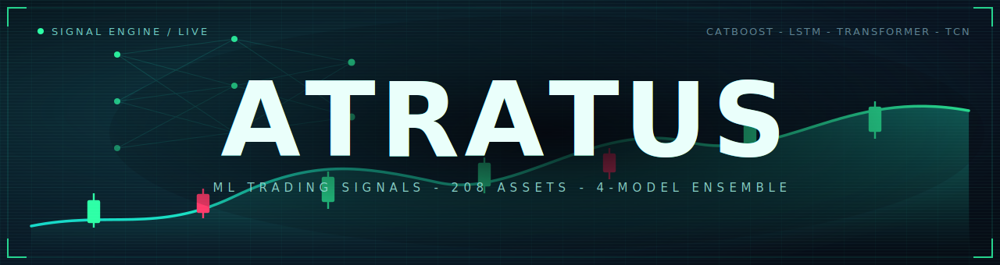
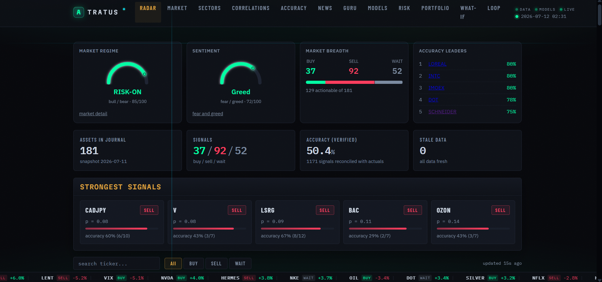
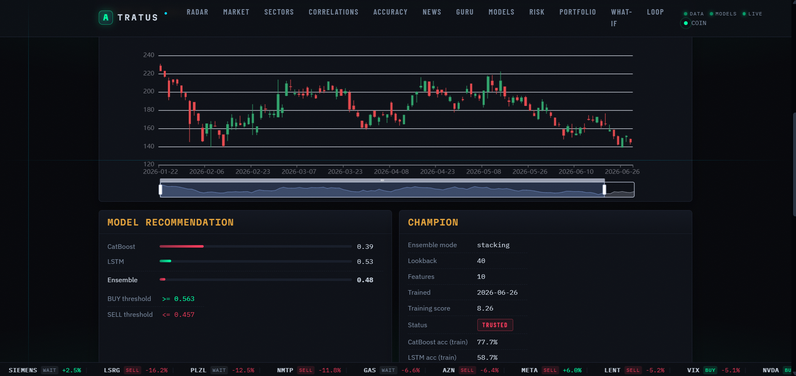

# Atratus



[](https://github.com/pavlenchichikov/Atratus/actions/workflows/ci.yml)
[](https://www.python.org/)
[](https://github.com/astral-sh/ruff)
[](LICENSE)

[English](README.md) · **Русский**

**Мультиактивный движок торговых сигналов на машинном обучении.** Пер-активный ансамбль (CatBoost + LSTM + Transformer + TCN) по ~208 рынкам — крипта, акции США / Европы / России, индексы, форекс и товары — с walk-forward-отбором чемпионов, калиброванными вероятностями, размером позиции по Келли, контролем хвостового риска, дашбордом на FastAPI и автономным, статистически-гейтованным исследовательским агентом. Только сигналы, человек в контуре — без автоисполнения.

> **Дисклеймер.** Atratus — исследовательский и учебный проект. Его вывод — набор модельных предсказаний, **а не финансовый совет и не рекомендация покупать или продавать какую-либо ценную бумагу**. Рынки несут риск, вы можете потерять деньги. ПО предоставляется «как есть», без каких-либо гарантий. Используйте на свой риск; проводите собственный анализ и консультируйтесь с лицензированным специалистом перед любым финансовым решением. Полный текст — в разделе [Дисклеймер](#дисклеймер). Юридически приоритетна английская версия и файл [`LICENSE`](LICENSE).

## Оглавление

- [Возможности](#возможности)
- [Как это работает](#как-это-работает)
- [Веб-интерфейс](#веб-интерфейс)
- [Скриншоты](#скриншоты)
- [Исследовательский агент](#исследовательский-агент)
- [Самоподдерживающийся цикл](#самоподдерживающийся-цикл)
- [Гейт по живой точности и рекалибровка](#гейт-по-живой-точности-и-рекалибровка)
- [Telegram-бот](#telegram-бот)
- [Публикация сигналов на лендинг](#публикация-сигналов-на-лендинг)
- [Мобильное приложение](#мобильное-приложение)
- [Технологии](#технологии)
- [Требования](#требования)
- [Быстрый старт](#быстрый-старт)
- [Обучение](#обучение)
- [Сеть](#сеть)
- [Конфигурация](#конфигурация)
- [Структура проекта](#структура-проекта)
- [Тесты](#тесты)
- [Лицензия](#лицензия)
- [Дисклеймер](#дисклеймер)

## Возможности

- **~208 активов, у каждого своя модель.** Для каждого актива обучается собственный ансамбль из четырёх моделей (CatBoost, LSTM, Transformer, TCN); чемпион выбирается walk-forward-бэктестом с комиссиями, проскальзыванием и эмбарго против утечки.
- **Честные, калиброванные сигналы.** BUY / SELL / WAIT с калиброванной вероятностью, пер-активными настроенными порогами и живым трек-рекордом точности, который сверяет каждое предсказание с реализованным движением следующего бара.
- **Управление риском по замыслу.** Размер позиции по Келли, стопы по просадке, проверки секторной экспозиции и корреляций, а также индекс хвостового риска Талеба, который уменьшает размер выше мягкого порога и блокирует новые покупки выше жёсткого.
- **Богатый набор признаков.** Доходности и волатильностно-нормированные доходности, хвостовой риск (эксцесс / асимметрия / VaR), RSI / MACD / SMA / ATR, недельные и межактивные корреляции, межактивный lead-lag, календарная позиция и макро-режим (доходность 10-леток, VIX, доллар).
- **Автономный исследовательский агент.** Поиск quality-diversity (MAP-Elites) по признакам, лейблам и трансформациям со строгим гейтом адопции на отложенной выборке (Wilcoxon signed-rank + Benjamini-Hochberg + межзапусковая репликация), чтобы ничего не адоптилось на шуме. Никогда не трогает прод автоматически.
- **Мгновенный дашборд на FastAPI.** Читает готовые предсказания из БД (без TensorFlow во время обслуживания), поэтому стартует сразу — радар сигналов, детализация по активу, аналитика портфеля, интерактивный риск-менеджер и what-if-бэктестер.
- **Value-оверлей.** «Совет гуру» (Линч, Баффет, Грэм, Мангер) как долгосрочный фундаментальный оверлей для реальных акций, с горизонтом точности 60 дней; ML-сигнал остаётся основным.

## Как это работает

1. `data_engine.py` скачивает до 15 лет дневных и недельных котировок с Yahoo Finance и MOEX в `market.db` (SQLite).
2. `train_hybrid.py` строит признаки (см. выше), обучает ансамбль и сохраняет чемпиона вместе со скейлером и калибратором вероятностей, выбранного walk-forward-бэктестом.
3. `predict.py` печатает BUY / SELL / WAIT с уверенностью по всем активам.
4. `backtest.py` проверяет чемпионов на отложенных данных: PnL, win rate, Sharpe, направленная точность, Brier, альфа против buy & hold.
5. `risk_manager.py` и `portfolio.py` делают размер позиции, лимиты убытка и проверки корреляций. Хвостовой риск гейтится индексом Талеба: размер сжимается выше мягкого порога, новые покупки блокируются выше жёсткого.

Вспомогательные слои: value-оверлей **«Совет гуру»** (`guru_report.py`, показывается только для активов с реальной фундаменталкой), сентимент новостей (`news_analyzer.py`), чтение рыночного режима / fear-greed и `db_check.py` — read-only аудит `market.db` (свежесть, корректность OHLC, пропуски, покрытие).

`app.py` — дашборд на Streamlit; Telegram-бот шлёт сигналы каждый час.

## Веб-интерфейс

```bash
uvicorn webapp:app --host 0.0.0.0 --port 8000
```

Лёгкий веб-интерфейс — без TensorFlow, читает предсказания из БД, стартует мгновенно. Страницы:

- `/` — радар сигналов: BUY / SELL / WAIT по каждому активу с уверенностью, живой точностью, колонкой хвостового риска Талеба, панелью рыночной ширины в реальном времени и датчиками режима / fear-greed
- `/asset/BTC` — детализация по активу: графики цены и свечей, история сигналов, консенсус моделей, хвостовой риск Талеба и value-вердикт Совета гуру (N/A для не-акций) с пересчётом по требованию
- `/portfolio` — аналитика портфеля по открытым позициям: диверсификация, тепловая карта секторной экспозиции, корреляции удерживаемых активов, пер-позиционные предупреждения
- `/whatif` — what-if-симулятор: «что если бы я вложил $X N дней назад, следуя сигналам», с кривой доходности и разбивкой по активам
- `/risk` — интерактивный риск-менеджер: открыть / закрыть позиции, править и сохранять лимиты риска, останавливать / возобновлять торговлю, плюс watchlist хвостового риска Талеба
- `/loop` — самоподдерживающийся цикл: статус дневного цикла и предложения по дрейфу, с одним кликом на подтверждение переобучения «чемпион-претендент»
- `/guru` — value-оверлей: вердикт совета рядом с ML-сигналом, трек-рекорд точности за 60 дней и кнопка **«Пересчитать всё»** в один клик, которая фоново переоценивает все акции
- `/market`, `/sectors`, `/correlations`, `/performance`, `/news`, `/models` — аналитические страницы

Те же данные в JSON под `/api/...`. Страницы обновляются сами; палитра Cmd-K переходит к любому активу или странице; внизу бежит лента топ-движений. Работает с телефона в той же сети.

## Скриншоты

**Радар сигналов** — домашний дашборд: датчики режима и сентимента, ширина рынка, лидеры точности и самые сильные живые сигналы с их трек-рекордом.



**Детализация по активу** — свечной график с рекомендацией модели (вероятности по каждой модели, настроенные пороги BUY / SELL) и карточкой чемпиона (режим ансамбля, тренировочный score, статус доверия).



**Сигналы на цене** — исторические вызовы BUY / SELL, нанесённые на линию цены, с выбираемым диапазоном времени.


**Консольный вывод** — `predict.py` печатает BUY / SELL / WAIT по каждому активу с калиброванной вероятностью, режимом ансамбля и чтением хвостового риска Талеба.

```text
$ python predict.py
  REAL-TIME RADAR  |  2026-07-12 02:31

  BTC      BUY    p=0.62  STACK  taleb=0.3
  ETH      WAIT   p=0.51  STACK
  NVDA     BUY    p=0.66  STACK  taleb=0.4
  SBER     SELL   p=0.38  STACK  taleb=1.2
  EURUSD   WAIT   p=0.49  STACK
  GOLD     BUY    p=0.58  STACK  taleb=0.2
```

## Исследовательский агент

Набор признаков можно расширять на обучении через ограниченный DSL трансформаций в `core/feature_dsl.py` (z-score, ratio, lag, diff, rolling, interaction, межактивный lead-lag поверх существующих колонок — без `eval`). Укажите `GTRADE_DSL_SPECS` на JSON со спеками и перечислите их имена в `GTRADE_EXTRA_FEATURES`; если обе переменные пусты, обучение не меняется.

`auto_research.py` (локальный инструмент, запускается через `auto_research.bat`) автоматизирует поиск — иллюминацию quality-diversity (MAP-Elites) по геномам признаков, лейблов и трансформаций, либо более простой forward-отбор. Предлагатель подаёт кандидата, дешёвый пре-скрин только по CatBoost отсекает явных аутсайдеров, а закешированный бейслайн сравнивается с кандидатом. Предлагатель по умолчанию — эволюционный поиск без LLM и без API-ключа; `GTRADE_AR_PROPOSER=llm` использует модель (Anthropic по умолчанию, OpenAI или любой OpenAI-совместимый эндпоинт вроде Mistral или **локального Ollama** через `GTRADE_AR_LLM=ollama`).

Геном также несёт **относительные гены гиперпараметров модели** (дельта глубины, множители learning rate и итераций, дельта lookback — применяются поверх настроенного бейслайна каждого актива, а не одним абсолютным числом для всех), **гены нейро-гигиены** (усреднение по сидам, пер-сетевая калибровка, взвешивание уникальности) и **лейбл triple-barrier** (его окно служит горизонтом). Те же рычаги ищутся по одному через оси `hyper`, `nets`, `thresholds`, `regime` и расширенную `labeling` в меню запуска.

Настройки времени отбора тоже ищутся: маржа порогов и дельта нейтральной полосы поверх собственных настроенных порогов каждого актива, и режим режим-фильтра (both / off / только-SMA / только-Талеб). Ниши QD-архива теперь ключуются ещё и по тому, КАКУЮ группу рычагов трогает геном, чтобы один класс рычагов не монополизировал карту, а дешёвый средний тир (4 актива на половине эпох, `GTRADE_AR_TIER=0` отключает) отсеивает явно отрицательных кандидатов до полного трейна.

Ре-гейтинг сохранённых кандидатов (`--regate`) **устойчив к сбоям**: каждый готовый кандидат чекпойнтится в `_regate_progress.json`, а его тренировки кешируются по сигнатуре генома, поэтому прерванный многодневный прогон продолжается с места остановки (пока рыночные данные не обновились), а не начинается заново.

**Он никогда не трогает прод.** Кандидаты обучаются в изолированные временные каталоги, а победитель помечается только после прохождения отдельной отложенной выборки под односторонним тестом **Wilcoxon signed-rank** (с практическим порогом размера эффекта, поправкой **Benjamini-Hochberg** по кандидатам, бюджетом итераций и гейтом **межзапусковой репликации**) — чтобы отсекать улучшения, которые лишь шум. Адопция помеченного победителя остаётся ручным полным ретрейном.

Постоянная межзапусковая память: `_ar_tried.json` (кандидат не тестируется повторно), `_ar_eval_cache.json` (базовые тренировки переиспользуются до прихода новых данных) и `_ar_findings.json` (накопительный журнал находок), так что бюджет покупает **новые** эксперименты каждый запуск.

**Research wiki (опционально, `GTRADE_AR_WIKI=1`).** Дистиллирует append-only журнал находок в накопительную самоподдерживающуюся базу знаний (паттерн «LLM Wiki» Карпаты): после каждого прогона LLM сворачивает новые находки в несколько связанных markdown-страниц под `_ar_wiki/`, помечая утверждения по уверенности и разрешая противоречия, и предлагатель читает эту дистилляцию вместо только последних находок. Страницы также рендерятся read-only на `/research`. По умолчанию выключено (байт-в-байт).

**Признаки-прогнозы Chronos (опционально, экспериментально).** Zero-shot прогнозы предобученной time-series модели как дополнительные признаки CatBoost. Установите `requirements-chronos.txt`, предпосчитайте кеш (`python precompute_chronos.py --assets all`), затем A/B через `GTRADE_CHRONOS=1 GTRADE_EXTRA_FEATURES=chronos_dir,chronos_ret,chronos_spread`. Они входят только через `GTRADE_EXTRA_FEATURES`, поэтому продовая модель не меняется до адопции.

## Самоподдерживающийся цикл

`loop_cycle.py` гоняет безопасный дневной пайплайн (данные, предсказание, сверка) и сканирует каждый актив на дрейф — скользящая точность ниже порога, падение от тренировочного бейслайна, возраст модели или устаревшие данные. Предложения появляются на `/loop`. Подтверждение запускает `loop_retrain.py` — RAM-безопасный ретрейн «чемпион-претендент», который заменяет чемпиона только если свежая модель его превзошла. **Цикл никогда не переобучает сам; переобучение всегда ждёт вашего подтверждения.** Зарегистрируйте `run_loop.bat` в планировщике задач для ежедневного запуска. Пороги дрейфа — в `core/drift.py` (`DRIFT_CONFIG`).

## Гейт по живой точности и рекалибровка

Сигналы, чей СЕГМЕНТ доказуемо плох в живом трек-рекорде, подавляются в WAIT до показа (`core/live_gate.py`): класс актива ниже 45% проверенной точности (n >= 100), актив ниже 40% (n >= 20) или анти-калиброванная экстремальная вероятность (>= 0.85 / <= 0.15). Трекер продолжает логировать СЫРОЙ сигнал, поэтому гейтнутый сегмент реабилитируется при улучшении свежей статистики; радар и веб-интерфейс показывают бейдж «gated» с причиной. `GTRADE_LIVE_GATE=0` отключает гейт; пороги — в env-ключах `GTRADE_LIVE_GATE_*`.

`python recalibrate_live.py` (еженедельно) обучает глобальный изотонический слой, отображающий сырые серв-вероятности в живой P(up) по проверенным исходам (`models/live_calib_global.pkl`; удалите файл для отката).

Точность, показываемая по активу, скоупится к текущему поколению модели, но откатывается на накопленную запись по всем поколениям, когда у активной модели ещё слишком мало проверенных сигналов, — поэтому ретрейн никогда не обнуляет панель для актива с реальной историей.

## Telegram-бот

`python alert_bot.py` гоняет ежечасный скан по всей вселенной активов, оценивая каждый актив через тот же общий пайплайн, что и `predict.py` (`core/scoring.py`), так что его вызовы в Telegram совпадают с дашбордом. Он также обслуживает `/top`, `/signal BTC`, `/risk`, `/digest` (только владелец), утренний дайджест (`GTRADE_DIGEST_HOUR`, по умолчанию 9) и предупреждения о деградации (данные старше 7 дней или точность ниже 40% на последних 20 проверенных сигналах).

## Публикация сигналов на лендинг

`push_signals.py` экспортирует свежий снимок сигналов в проект Supabase, который питает публичный лендинг. Он читает пер-активный последний сигнал и точность из локального журнала (модели не грузятся), затем upsert-ит полную таблицу `signals` (гейтнутую пер-пользовательским allow-list через row-level security) и анонимизированную строку `public_stats` (публичный тизер: счётчики BUY / SELL / WAIT, точность, ширина рынка и дата снимка).

Тот же запуск питает мобильное приложение: он экспортирует пер-активную историю OHLC (`bars`), недавний трек-рекорд сигналов (`signal_history`) и вердикты Совета гуру (`guru`, `guru_stats`) — всё гейтнуто тем же allow-list — и, когда `GTRADE_FCM_CREDS` указывает на JSON сервис-аккаунта Firebase, шлёт персональное push-уведомление с топ-сигналами дня на зарегистрированные устройства allow-list-пользователей.

Задайте `SUPABASE_URL` и `SUPABASE_SERVICE_KEY` в `.env` (service-ключ секретен и не должен попадать в git или в браузер), затем запускайте после `predict.py`:

```bash
python push_signals.py          # или пункт [SG] в run_gtrade.bat
```

Запускайте вручную ежедневно или поставьте в планировщик, когда всё устроит.

## Мобильное приложение

Компаньон — приложение на **Flutter** (Android) — это тонкий клиент того же снимка Supabase: в приложении нет ни моделей, ни рыночных данных, оно лишь читает гейтнутый фид, который публикует `push_signals.py`. Вход по magic-link и тот же пер-пользовательский allow-list (row-level security) гейтят каждый экран. Есть радар сигналов, детализация по активу с графиками, value-оверлей гуру, разбивка по секторам рынка, топ по точности, лента недавних проверенных сигналов и клиентский what-if-симулятор; данные обновляются при возврате в приложение и по «потянуть вниз». Опциональный Firebase Cloud Messaging (`GTRADE_FCM_CREDS`) доставляет топ-сигналы дня push-уведомлением. Схема Supabase для этих таблиц — в [`supabase/mobile_app.sql`](supabase/mobile_app.sql).

## Технологии

- **Язык:** Python 3.12
- **ML:** CatBoost, TensorFlow / Keras (LSTM, Transformer, TCN), scikit-learn, Optuna, scipy; опционально Amazon Chronos (zero-shot прогнозы)
- **Обслуживание / UI:** FastAPI + Uvicorn (веб-интерфейс), Streamlit (`app.py`), Jinja2
- **Мобильное:** тонкий клиент на Flutter (Android) поверх Supabase; Firebase Cloud Messaging
- **Данные:** SQLite (`market.db`), pandas / numpy, Yahoo Finance + MOEX
- **Исследовательский агент:** поиск quality-diversity MAP-Elites; подключаемый LLM-предлагатель (Anthropic / OpenAI / локальный Ollama)
- **Ops / инструменты:** Ruff, pytest, CI на GitHub Actions, Telegram Bot API

## Требования

- **Python 3.12** (3.11+ вероятно подойдёт; CI гоняет на 3.12).
- **ОС:** Linux, macOS или Windows. На Windows TensorFlow только-CPU с версии 2.11 — нормально для обучения на дневных барах; для GPU используйте WSL2.
- **Диск:** ~5 ГБ свободно — обученные модели (~4 ГБ на все 208 активов) плюс `market.db` (~70 МБ). Только для обслуживания нужно куда меньше.
- **RAM:** 8 ГБ хватает для дашборда и `predict.py` (без TensorFlow во время обслуживания). Обучение всей вселенной хочет ~16 ГБ, либо обучайте чанками по ~15 активов (`GTRADE_ASSETS`) на слабой машине.
- **GPU:** опционально. Нейросети по умолчанию учатся на CPU; CatBoost может использовать GPU (`GTRADE_CB_DEVICE=GPU`), но часто медленнее на маленьких пер-активных датасетах.
- **Сеть:** исходящий доступ к Yahoo Finance и MOEX для данных (`SOCKS5_PROXY` поддерживается).

## Быстрый старт

```bash
pip install -r requirements.txt
cp .env.example .env          # токен telegram, прокси при необходимости

python data_engine.py         # скачать рыночные данные
python train_hybrid.py        # обучить модели
python predict.py             # сигналы в консоль
streamlit run app.py          # дашборд
```

`python launcher.py` открывает текстовое меню над всем вышеперечисленным (полный цикл, дашборд, веб-интерфейс, predict, аудит БД и не только). `python db_check.py` гоняет read-only аудит `market.db` (`--fix` чинит дубликаты и форматы дат). `python scheduler.py` работает демоном: данные каждые 6ч, предсказания каждые 4ч, ежедневная проверка БД.

## Обучение

TensorFlow на Windows только-CPU с версии 2.11, поэтому нейро-обучение идёт на CPU — нормально для дневных данных. Для GPU используйте WSL2 и `pip install tensorflow[and-cuda]`.

TensorFlow накапливает память по многим активам в одном процессе, поэтому полный ретрейн на 208 активов на машине с ограниченной памятью лучше гонять чанками (~15 активов через `GTRADE_ASSETS`), перезапуская свежий процесс на каждый чанк; реестр чемпионов накапливается по активам, так что чанки складываются в полный прогон. Готовый оркестратор для этого — `train_chunked.py`.

Опциональные env-флаги для `train_hybrid.py`:

- `GTRADE_ADAPTIVE_NETS=1` — размерить каждую сеть под данные актива (меньше параметров, быстрее, меньше переобучения); по умолчанию выключено, остаются исходные «плоские» сети
- `GTRADE_NET_CAP` — потолок для адаптивных LSTM-юнитов (по умолчанию 128); главный рычаг скорости / RAM
- `GTRADE_EPOCHS_LSTM`, `GTRADE_EPOCHS_TF`, `GTRADE_EPOCHS_TCN` — потолки эпох по сетям (по умолчанию 160, 100, 80)
- `GTRADE_FEATURE_SET=base|ext` — на каком наборе признаков учиться (`ext` — адоптированный дефолт)
- `GTRADE_FORCE_PROMOTE=1` — принимать новых чемпионов независимо от score (используйте после смены набора признаков)
- `GTRADE_ASSETS=BTC,ETH,NVDA` — обучать только перечисленные активы (подмножество или чанк)
- `GTRADE_HISTORY_DAYS`, `GTRADE_BACKFILL=1` — глубина выборки и до-скачивание старых баров
- `GTRADE_WORKERS`, `GTRADE_MAX_FOLDS` — параллельные воркеры и потолок walk-forward фолдов
- `GTRADE_CB_DEVICE=GPU` — гонять CatBoost на GPU (сначала замерьте; часто медленнее на маленьких пер-активных датасетах)

У walk-forward-объектива отбора есть env-гейтованный v2 (`GTRADE_OBJECTIVE_V2=1`): издержки берутся на СМЕНАХ позиции, а не на каждом сигнальном баре (как позиции показываются на страницах активов), Sharpe и просадка считаются по дневной кривой доходности, а фиксированный клип ±4% на бар становится пер-активным вол-масштабируемым капом. `python ab_objective.py` обучает подмножество под обоими объективами в изолированные каталоги и сравнивает чемпионов по общему аршину `Score_v2`; дефолт остаётся v1, пока этот A/B и полный ретрейн не скажут иначе.

## Сеть

Если `SOCKS5_PROXY` задан в `.env`, исходящие запросы идут через него; `net.py` проверяет, что прокси жив, и откатывается на прямое соединение.

- `GTRADE_PROXY_MODE=auto|on|off` (по умолчанию auto)
- `GTRADE_SSL_VERIFY=0` отключает проверку TLS-сертификатов (по умолчанию включена; выключайте только если ваш прокси перехватывает TLS)

## Конфигурация

- `.env` — учётные данные telegram, прокси (никогда не коммитится; см. `.env.example`)
- `config.py` — список активов и пороги buy/sell
- `auto_trader_config.json` — настройки бумажной торговли
- `pyproject.toml` — конфигурация Ruff и pytest

## Структура проекта

```text
data_engine.py        выборка дневных/недельных котировок (Yahoo + MOEX) в market.db
train_hybrid.py       обучение пер-активного ансамбля + walk-forward отбор
train_chunked.py      RAM-безопасный полный ретрейн (свежий процесс на чанк)
predict.py            радар сигналов в консоли
backtest.py           оценка на отложенных данных (PnL, Sharpe, Brier, альфа)
webapp.py             дашборд на FastAPI (app.py = Streamlit)
alert_bot.py          Telegram-бот (ежечасный скан)
risk_manager.py       размер по Келли, лимиты убытка/просадки, гейт Талеба
guru_report.py        фундаментальный оверлей «Совет гуру»
auto_research.py      автономный исследовательский агент (через auto_research.bat)
push_signals.py       публикация снимка в Supabase (веб + мобильное)
scheduler.py          демон: данные / предсказание / проверка БД по расписанию
launcher.py           текстовое меню над всем пайплайном
core/                 общая библиотека: признаки, ансамбль, скоринг, калибровка,
                      бэктест, риск, live_gate, guru, dashboard, ...
tests/                pytest-набор (600+ тестов)
supabase/             SQL-схема для Supabase-бэкенда веба/мобильного
```

## Тесты

```bash
pytest -q
ruff check .
```

## Лицензия

Creative Commons Attribution-NonCommercial 4.0 (CC BY-NC 4.0). См. [`LICENSE`](LICENSE).

## Дисклеймер

Atratus предоставляется **только в исследовательских и учебных целях**. Это не инвестиционный совет, не финансовый совет и не рекомендация, приглашение или предложение покупать или продавать какую-либо ценную бумагу или финансовый инструмент. Торговля и инвестирование сопряжены со значительным риском потерь и подходят не каждому инвестору; прошлые или смоделированные результаты не гарантируют будущих. Авторы и контрибьюторы не несут ответственности за любые убытки или ущерб от использования этого ПО, предоставляемого «КАК ЕСТЬ», без каких-либо гарантий. Вы единолично отвечаете за свои решения — проводите собственный анализ и консультируйтесь с лицензированным финансовым специалистом, прежде чем действовать на основе чего-либо, произведённого этим проектом. Юридически приоритетна английская версия.
